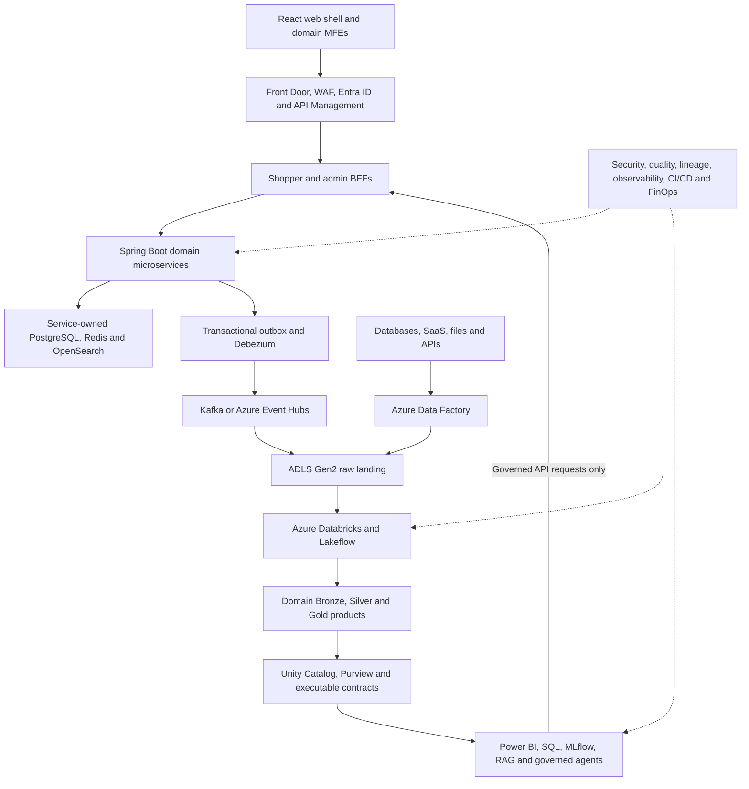

# Retail Intelligence Platform — End-to-End Architecture and Roadmap

**Scope:** Web-only React/TypeScript micro-frontends, BFFs, Spring Boot microservices, event-driven integration, Azure Databricks data mesh, analytics, ML/deep learning, GenAI/RAG, governed agents and production operations.

**Scale:** 20M+ records locally, expandable to 100M+ records and production streaming workloads.

**Roadmap:** 24 phases, exactly 120 lessons and six release gates.

## Documentation index

| Area | Start here | Contents |
|---|---|---|
| Start and installation | [Getting started](getting-started/README.md) | Clean repository creation, workstation checks and one-lesson implementation cycle |
| Complete source of truth | [Master architecture and roadmap](architecture/retail-intelligence-platform-architecture-and-roadmap.md) | The complete architecture, decisions, products, phases and 120 lessons |
| Documentation layout | [Documentation tree](TREE.md) | Every documentation file and its purpose |
| Architecture | [Architecture overview](architecture/README.md) | System boundaries, principal flows and architecture rules |
| Application | [Web MFE and microservices](architecture/application-platform.md) | React shell/MFEs, BFFs, Spring Boot services and operational stores |
| Events | [Reliable event platform](architecture/event-platform.md) | Outbox, Debezium, Kafka/Event Hubs, contracts, sagas and replay |
| Data engineering | [Azure Databricks data mesh](architecture/data-mesh.md) | Domains, products, contracts, ADF, ADLS, Lakeflow, Purview and Unity Catalog |
| Intelligence | [Analytics, ML and AI](architecture/analytics-ml-ai.md) | BI, features, ML/DL, RAG, agents and governed feedback |
| Platform | [Deployment, security and operations](architecture/platform-operations.md) | Azure topology, identity, CI/CD, observability, DR and FinOps |
| Diagrams | [Diagram index](diagrams/README.md) | End-to-end, data flow, data mesh, saga and intelligence diagrams |
| Roadmap | [Roadmap index](roadmap/README.md) | Milestones and navigable phase volumes |
| Contracts | [Contract index](contracts/README.md) | Event envelope and data-product contract examples |
| APIs | [API standards](api/README.md) | Browser/BFF/service boundaries, headers, idempotency and versioning |
| Data flows | [Data-flow index](data-flow/README.md) | Command, event, batch, lakehouse, BI, ML, RAG and action flows |
| Data models | [Modeling standards](data-model/README.md) | Operational, event, medallion, feature and knowledge models |
| Events | [Event documentation](events/README.md) | Event catalog, naming, reliability and prohibited content |
| Data products | [Data-product standard](data-products/README.md) | Required product contract, certification and initial inventory |
| Governance | [Federated governance](governance/README.md) | Authority, policy and domain/platform responsibilities |
| Learning | [Learning and evidence](learning/README.md) | Lesson template, evidence convention and progress tracker |
| Decisions | [Architecture decision records](decisions/README.md) | ADR inventory, template and decision workflow |
| Security | [Security and privacy](security/README.md) | Trust boundaries, threat model and AI controls |
| Testing | [Test strategy](testing/README.md) | Application, event, data, ML, AI, resilience and performance testing |
| Runbooks | [Runbook index](runbooks/README.md) | Local platform, replay/recovery and planned operated procedures |
| Operations | [Production readiness](operations/production-readiness.md) | Release checklist, evidence and runbook index |
| References | [Verified references](references.md) | Primary implementation documentation and conceptual inputs |

## End-to-end architecture

## Non-negotiable architecture rules

1. The web frontend is React/TypeScript only. MFEs use BFF/domain APIs and never connect directly to databases, Kafka/Event Hubs or Databricks.
2. Each Spring Boot microservice owns its writable schema/database, invariants, migrations, APIs and events.
3. Operational services remain systems of record. BI, ML, RAG and agents cannot write operational databases directly.
4. A service commits domain state and its outbox record atomically. Debezium publishes the outbox event.
5. Event delivery is treated as at least once end to end. Consumers use event IDs, deduplication, idempotent effects and reconciliation.
6. One authoritative event backbone is selected per stream. Local development uses Kafka; Azure uses Event Hubs or managed Kafka only after compatibility testing.
7. A data product requires an owner, purpose, consumers, contract, ports, schema, semantics, quality rules, SLO, classification, lineage, runbook, cost and lifecycle.
8. Microsoft Purview supports enterprise discovery, glossary and classification. Unity Catalog governs Databricks assets, access and technical lineage.
9. ML begins with deterministic and classical baselines. Deep learning must earn its additional complexity through measured value.
10. Agents use typed, least-privileged domain API tools. Sensitive actions require policy or human approval.

## Roadmap summary

| Milestone | Phases | Lessons | Outcome |
|---|---:|---:|---|
| Web MFE and transactional microservices | 1–7 | 35 | React shell/MFEs, BFFs, Spring Boot services, databases, checkout, payment, inventory, fulfillment and engagement |
| Reliable event platform | 8–10 | 15 | Kafka/Event Hubs contracts, outbox CDC, Debezium, sagas, replay, reconciliation and 20M→100M testing |
| Governed lakehouse and data mesh | 11–15 | 25 | ADF, ADLS, Bronze/Silver/Gold, data products, Purview, Unity Catalog, KPIs, quality, lineage and BI |
| ML and deep learning | 16–20 | 25 | Features, forecasting, recommendations, deep learning, MLflow, serving, experimentation and monitoring |
| GenAI and agentic AI | 21–23 | 15 | LLM evaluation, RAG, multimodal processing, governed tools, approvals and controlled agents |
| Production capstone | 24 | 5 | Terraform/Bicep, CI/CD, security, resilience, DR, FinOps and production-readiness testing |
| **Total** | **1–24** | **120** | **Complete end-to-end implementation** |

## New-project starting point

This repository is a clean start named `retail-intelligence-ecommerce`. Do not copy build output, generated caches, secrets, local databases or incomplete implementation from the earlier `retail-intelligence-platform` tree.

Start with [installation](getting-started/installation.md), then execute `L001` through `L005`. The first implementation checkpoint is the Catalog vertical slice: React shell and Catalog MFE → shopper BFF → Catalog service → service-owned PostgreSQL → transactional outbox. Kafka/Debezium and Bronze/Silver/Gold are added at their roadmap phases, with evidence gates before expanding to other domains.

## Documentation maintenance rules

- The [master architecture and roadmap](architecture/retail-intelligence-platform-architecture-and-roadmap.md) is authoritative.
- The roadmap volumes are generated from the master lesson section. Do not renumber lessons independently.
- Architecture changes require an ADR and matching diagram/document updates.
- Published event and data-product contracts are versioned and compatibility-tested.
- Broken relative links, invalid Mermaid blocks, missing lessons and duplicated lesson numbers fail documentation validation.
