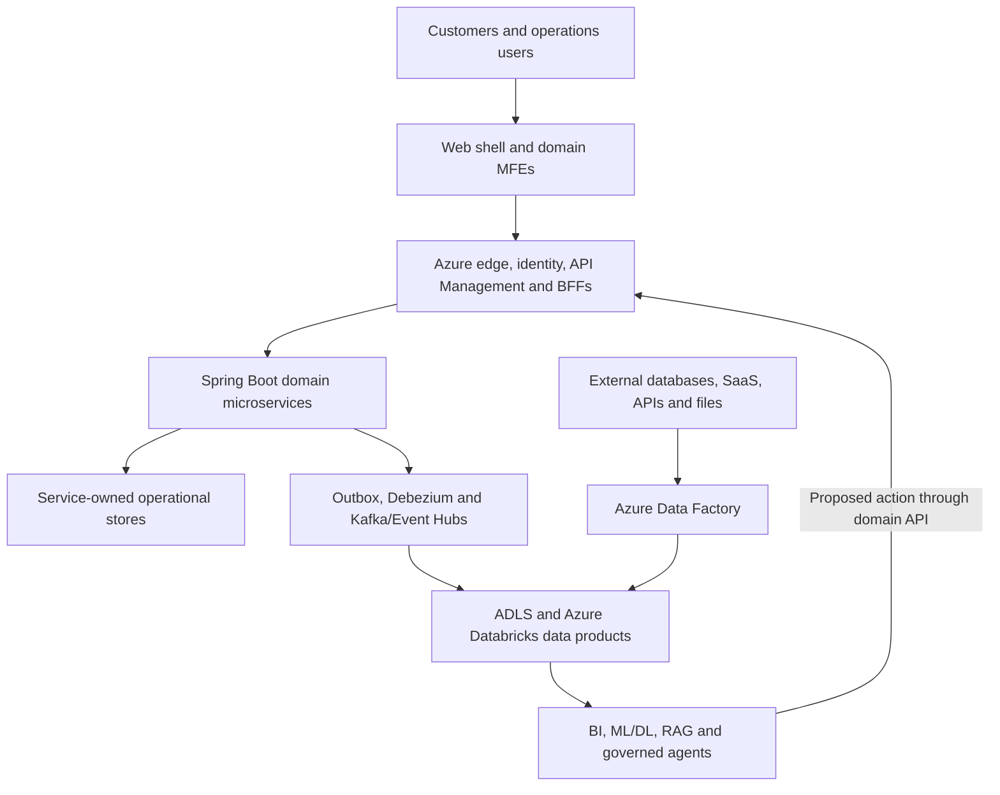

# Architecture Overview

[Documentation home](../README.md) · [Master architecture and roadmap](retail-intelligence-platform-architecture-and-roadmap.md) · [Diagrams](../diagrams/README.md)

## Architecture objective

Build a production-style retail platform that demonstrates the complete flow from a web interaction through transactional microservices, events and CDC, domain-owned lakehouse products, analytics/ML/GenAI and a governed feedback action.

The platform is divided into three connected planes and one control fabric:

| Plane | Responsibility | Must not do |
|---|---|---|
| Web experience | React shell, domain MFEs, identity bootstrap, navigation, UX, telemetry and BFF calls | Access databases, Kafka/Event Hubs or Databricks directly |
| Operational commerce | Spring Boot services, transactional invariants, service-owned data, APIs, outbox events, sagas and operational read models | Share writable tables or delegate business truth to analytics/AI |
| Data and intelligence | Ingest events/files, build domain products, BI, features, ML/DL, RAG and bounded agents | Mutate operational stores directly or redefine source-domain semantics silently |
| Control fabric | Identity, contracts, governance, quality, lineage, security, observability, CI/CD, SRE and FinOps | Become a manual centralized bottleneck for every domain change |

## System context

## Domain map

| Domain | Operational ownership | Representative data products | Intelligence consumers |
|---|---|---|---|
| Customer | Identity, profile, address, consent and preference | Customer history, consent ledger and customer 360 | Segmentation, churn, CLV, personalization and support |
| Product | Catalog, pricing, promotions and search projection | Product master/history, price history, catalog quality | Search ranking, recommendations, attribute extraction and merchandising |
| Commerce | Cart, checkout, order and return | Cart funnel, orders, returns and net revenue | Conversion, return propensity and enterprise KPIs |
| Payment/Risk | Token-safe payment ledger, provider integration and reconciliation | Payment outcomes, decline analysis and risk signals | Fraud/risk scoring and financial reconciliation |
| Supply | Inventory, warehouse, reservation and fulfillment | Stock movements, availability and fulfillment performance | Forecasting, replenishment, ETA and stockout risk |
| Engagement | CMS, CRM, notification, support and behavioral tracking | Campaign, session, support knowledge and outcome products | Attribution, RAG, sentiment and next-best action |
| Data/AI platform | Landing zones, ingestion, catalogs, quality, orchestration and serving | Golden-path templates, reference products and evaluation products | All domain producers and consumers |

## Primary flows

1. **Command flow:** MFE → Front Door/WAF → Entra ID/API Management → BFF → owning service → service-owned database.
2. **Event flow:** service transaction + outbox → Debezium/Kafka Connect → Kafka or Event Hubs → raw archive/Bronze.
3. **Batch flow:** source/API/file → Azure Data Factory → ADLS raw landing → Auto Loader/Lakeflow.
4. **Product flow:** Bronze → Silver trusted domain state → Gold aggregate/consumer product → contracted output port.
5. **Intelligence flow:** product → BI/features/model/RAG/agent → evaluated result → governed API request → owning service.
6. **Control flow:** identity, contracts, policy, quality, lineage, telemetry, cost and lifecycle controls apply at every boundary.

## Architecture documents

- [Web MFE and microservices](application-platform.md)
- [Reliable event platform](event-platform.md)
- [Azure Databricks data mesh](data-mesh.md)
- [Analytics, ML and AI](analytics-ml-ai.md)
- [Deployment, security and operations](platform-operations.md)

## Decision principles

- Prefer a deterministic workflow when steps and rules are known.
- Add a distributed component only when isolation, scale, availability, ownership or regulatory evidence justifies it.
- Use asynchronous events for completed facts and work that can finish later; use synchronous APIs when an immediate answer is required.
- Keep one definition for a business measure and one declared authority for each metadata attribute.
- Design replay, reconciliation, deletion, rollback and recovery before claiming production readiness.

