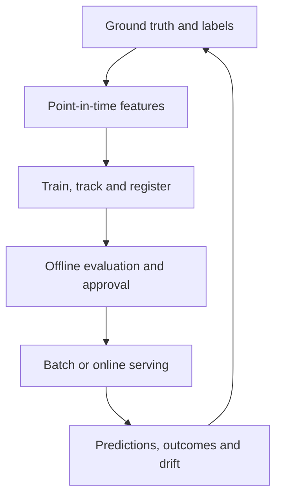
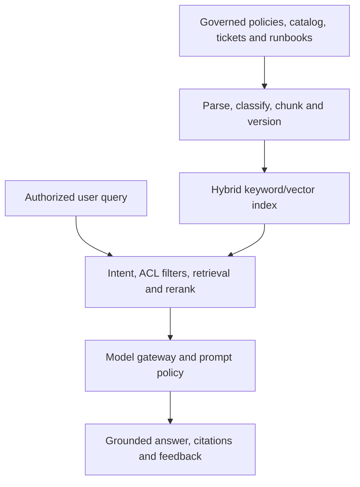
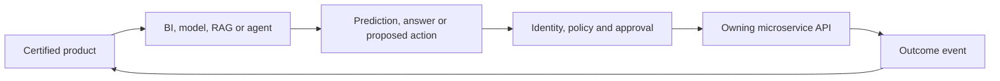

# Analytics, Machine Learning and AI Architecture

[Architecture overview](README.md) · [Intelligence feedback diagram](../diagrams/intelligence-feedback-loop.md) · [Roadmap phases 11–20](../roadmap/phases-11-20.md) · [Roadmap phases 21–24](../roadmap/phases-21-24.md)

## Governed consumption

Consumers discover a certified product, review its contract, request purpose-bound access and use a supported output port. Usage and lineage register the dependency so incidents, breaking changes and deprecations reach the consumer.

Operational MFE screens use service APIs/read models. They do not issue ad hoc lakehouse queries. Databricks SQL/Power BI, ML pipelines, RAG and agents use separate governed identities.

## Semantic/KPI layer

Every KPI contract defines its grain, population, time window, statuses, currency conversion, tax/shipping/discount treatment, late corrections, owner, freshness and reconciliation.

Examples requiring explicit semantics:

- Gross merchandise value and net revenue.
- Conversion and cart abandonment.
- In-stock and stockout rates.
- On-time delivery.
- Customer lifetime value.
- Return/refund rates.
- Promotion uplift and campaign attribution.

Certified semantic models query Gold products through Databricks SQL and Power BI. Changes require owner approval, metric tests and consumer communication.

## Intelligence selection ladder

| Level | Use when | Retail examples |
|---|---|---|
| Deterministic rule | Logic is explicit, stable and auditable | Coupon eligibility, compliance checks and warehouse eligibility |
| Classical ML | Structured history predicts a target with measurable baseline | Demand, churn, fraud risk, return and conversion propensity |
| Deep learning | Sequence, graph, text/image or scale beats classical methods | Two-tower retrieval, session Transformer and multimodal search |
| Generative AI | The output is grounded language/image generation | Support answer, product copy and analytics explanation |
| Agentic workflow | Bounded planning/tool use is required | Support triage, return investigation and data-quality diagnosis |

Use the lowest level that meets the requirement safely and economically.

## Production ML loop

The loop includes:

- Observable target, ground-truth definition and delayed/manual label handling.
- Time/entity-aware train/validation/test splits and leakage tests.
- Point-in-time feature joins and an online path only when latency requires it.
- Reproducible code, data, environment, parameters, metrics and artifacts.
- MLflow tracking and Unity Catalog model registration/approval metadata.
- Batch or online serving with validation, timeout, fallback and versioning.
- Shadow, canary, A/B and champion/challenger rollout with rollback.
- Drift, quality, calibration, fairness, latency, error, cost and business-impact monitoring.
- Prediction-to-outcome linkage and gated retraining.

## Initial model sequence

1. **Demand forecast:** seasonal-naive baseline, then statistical/tree models and only then justified neural sequence models.
2. **Recommendations:** popularity, co-occurrence and collaborative filtering before two-tower/session models.
3. **Churn/propensity:** logistic regression baseline before ensembles.
4. **Fraud/anomaly:** deterministic rules plus supervised/unsupervised signals; payment/risk service owns final action.
5. **Delivery ETA:** calibrated prediction intervals, not only a point estimate.

## Feature products

Features are governed data products with owner, definition, entity key, timestamp, freshness tier, null/default behavior, lineage and consumers. Required tests cover point-in-time correctness, determinism, leakage, distribution, freshness and training-serving parity.

Publish online features only when decision latency requires them. Batch features are simpler and cheaper.

## Deep-learning architecture selection

| Family | Candidate use | Admission gate |
|---|---|---|
| Discriminative | Classification, scoring, ranking and forecasting | Beats an interpretable baseline on business and system metrics |
| Generative | Text/image generation, embeddings and synthetic data | Output is labeled/reviewed and cannot become ledger truth |
| Hybrid | Retrieval + reranking, multimodal + LLM and RAG | Each stage is evaluated separately |

Measure accuracy/relevance together with p95 latency, throughput, GPU/compute cost, cold-start behavior, explainability and operational support.

## RAG architecture

RAG requirements:

- Preserve document, row and tenant access control during retrieval.
- Store source ID, version, effective date, market/language and classification.
- Use structured-data/API/SQL tools for authorized operational facts rather than embedding broad sensitive datasets.
- Propagate source deletion and access changes into indexes.
- Evaluate retrieval recall/context precision, correctness, groundedness, citation validity, safety, latency and cost.
- Redact privacy-sensitive traces and connect expert/user feedback to evaluation datasets.

## Governed agents

| Agent | Allowed | Requires approval or is prohibited |
|---|---|---|
| Customer support | Search authorized knowledge/order status, draft reply and create ticket | Refund, cancellation, policy override or another customer's data |
| Merchandising | Analyze products/sales, draft content and propose bundles/prices | Direct publication or price mutation |
| Inventory planner | Read stock/forecast and simulate replenishment | Commit purchase order or change safety stock |
| Fraud assistant | Summarize signals and evidence | Autonomous block unless an approved deterministic policy owns it |
| Data-quality investigator | Read lineage/tests/logs, propose fix and rerun safe job | Modify production data/contracts without change approval |
| Analytics copilot | Query certified semantic models read-only | Raw restricted PII or unreviewed metric definitions |

Agent controls include typed tool schemas, scoped workload identity, input/output validation, bounded steps/time/spend, idempotency, policy-as-code, dry run, human approval, audit trail, compensation, escalation and kill switch.

Use a deterministic state machine when the steps are known. Add an agent only to handle bounded ambiguity, tool selection or synthesis. Multi-agent systems require separate permissions/evaluation/failure-isolation evidence.

## Controlled feedback

No model or agent writes order, price, payment, stock, consent or customer records directly.

## Intelligence release gates

### ML/DL

- Target, labels, split, baseline, metrics and feature timestamps are valid.
- Model beats the baseline and has a deterministic fallback.
- Registry, approval, rollout, rollback and feedback are reproducible.
- Online quality and business impact are monitored.

### RAG/agents

- Retrieval honors ACLs, freshness, versions and deletion.
- Golden and adversarial evaluations meet thresholds.
- Tools are typed, least-privileged, audited, idempotent and time-bounded.
- Sensitive actions require policy/human approval.
- Prompt injection, data exfiltration, memory poisoning, privilege misuse, cascading failure and cost attacks are tested.

