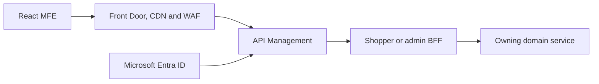

# Web MFE and Microservices Architecture

[Architecture overview](README.md) · [Event platform](event-platform.md) · [Roadmap phases 1–10](../roadmap/phases-01-10.md)

## Target application tree

```text
applications/
├── frontend/
│   ├── shell/
│   ├── mfes/
│   │   ├── account/
│   │   ├── catalog-search/
│   │   ├── cart-checkout/
│   │   ├── orders-fulfillment/
│   │   ├── support/
│   │   └── admin/
│   ├── experiences/
│   │   ├── customer-web/
│   │   └── admin-web/
│   ├── packages/
│   └── shared/
└── backend/
    ├── api-gateway/
    ├── bffs/
    │   ├── shopper-bff/
    │   └── admin-bff/
    ├── platform/
    ├── services/
    │   ├── identity-service/
    │   ├── customer-service/
    │   ├── catalog-service/
    │   ├── pricing-service/
    │   ├── cart-service/
    │   ├── checkout-service/
    │   ├── payment-service/
    │   ├── order-service/
    │   ├── inventory-service/
    │   ├── fulfillment-service/
    │   ├── engagement-service/
    │   └── support-service/
    └── shared/
```

This is a target decomposition. Do not create empty deployables merely to match the tree. Extract an MFE or service only when it has a clear owner, contract, independent release need or isolation requirement.

## Web composition

| Deployable | Scope | Backend | Release rule |
|---|---|---|---|
| `shell` | Routing, layout, identity bootstrap, navigation, feature flags, error boundaries and telemetry | Experience endpoints only | Independently deployable; contains no domain business logic |
| `account-mfe` | Sign-in, profile, address, consent and preferences | Customer/identity APIs | Generated API client and contract tests |
| `catalog-mfe` | Browse, search, product detail, price and promotion display | Catalog/search/pricing BFF | SEO/cache behavior and price authority are explicit |
| `cart-checkout-mfe` | Cart, quote, checkout and payment-provider handoff | Cart/checkout BFF | Preserves idempotency key across safe retries |
| `orders-mfe` | Order history, returns and shipment tracking | Order/fulfillment BFF | Uses operational read APIs, never Gold tables |
| `support-mfe` | Knowledge search, tickets and governed assistant | Support/AI gateway | Shows citations, escalation and action approval state |
| `admin-mfe` | Catalog, pricing, inventory, campaigns and support operations | Purpose-specific admin BFF | Separate privileged roles and audited changes |

### MFE rules

- Begin with route-based composition. Use runtime module federation only where independent runtime loading is justified.
- Share design tokens, identity/session helpers, telemetry and generated contract types—not a large shared business library.
- Use URL state, shell-owned context or small versioned browser events for cross-MFE coordination.
- Each MFE has an accessibility gate, error boundary, bundle/performance budget, component tests, composition tests and rollback path.
- The browser holds no payment secret and receives only the minimum authorized customer data.

## Edge, identity and BFF



Edge/BFF controls include TLS, CSP/CORS, OIDC with PKCE, token validation, rate limits, bot controls, input validation, correlation/trace IDs, caching rules, timeouts and safe aggregation. Authorization is rechecked in the owning service.

## Microservice boundaries

| Capability | Source of truth | Principal events | Critical invariant |
|---|---|---|---|
| Customer | PostgreSQL customer schema/database | `CustomerCreated`, `ProfileUpdated`, `ConsentChanged` | Consent and status transitions are authorized and auditable |
| Catalog | PostgreSQL catalog plus media store | `ProductCreated`, `ProductPublished`, `ProductUpdated` | Only approved products become sellable |
| Pricing | Effective-dated price/promotion ledger | `PriceChanged`, `PromotionActivated` | One applicable price calculation is deterministic and auditable |
| Cart | Redis active state plus durable history | `ItemAddedToCart`, `CartAbandoned`, `CartConverted` | Cart totals are recalculated against authoritative pricing |
| Checkout | Persisted workflow/saga state | `CheckoutStarted`, `CheckoutFailed`, `CheckoutCompleted` | Duplicate submission cannot duplicate business effects |
| Payment | Token/reference and provider reconciliation ledger | `PaymentAuthorized`, `PaymentCaptured`, `RefundCompleted` | Card data remains with the provider; commands are idempotent |
| Order | Order and status ledger | `OrderCreated`, `OrderConfirmed`, `OrderCancelled` | Status transition and order totals remain consistent |
| Inventory | Stock, movement and reservation ledgers | `InventoryReserved`, `StockAdjusted`, `StockoutDetected` | Available stock cannot be oversold under concurrent requests |
| Fulfillment | Shipment and carrier status history | `ShipmentDispatched`, `DeliveryStatusChanged`, `Delivered` | External status is verified and mapped deterministically |
| Engagement/Support | Campaign, notification, ticket and knowledge data | `CampaignSent`, `TicketOpened`, `TicketResolved` | Consent/suppression applies before communication |

## Database ownership

- Local learning may use one PostgreSQL cluster with isolated schemas and roles.
- Every service receives a unique database credential and owns migrations for only its schema.
- Production services may move to separate databases/clusters when scale, blast radius, recovery or compliance requires it.
- Cross-domain reads use APIs, events or certified analytical products according to consistency and latency needs.
- Redis and OpenSearch are projections/caches and must be rebuildable. They are not substitutes for the source-of-truth ledger.

## API contract baseline

Every command API defines authentication, authorization, idempotency, validation, optimistic concurrency, timeout, error envelope, trace ID and audit behavior. Every query API defines pagination, filters, sorting, consistency/freshness and sensitive-field policy.

OpenAPI generates TypeScript and Java clients. Consumer/provider contract tests run before integration deployment. Breaking changes require a versioned migration path.

## Application release gate

- MFEs deploy and roll back independently without breaking shell composition.
- BFF and service contract tests pass against current and previous compatible versions.
- No service writes another service's tables.
- Duplicate checkout/payment/order commands create one business outcome.
- Failed saga steps compensate or reconcile.
- Authentication, authorization, abuse, privacy, accessibility and performance tests pass.
