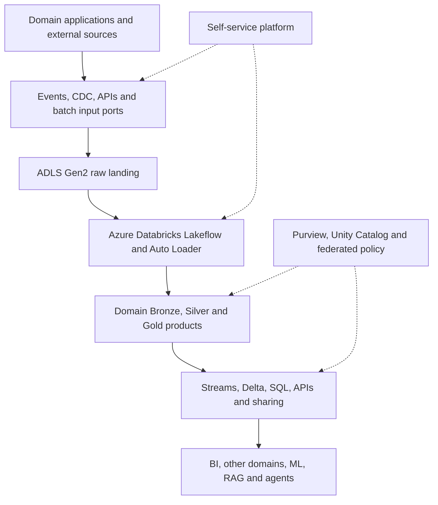
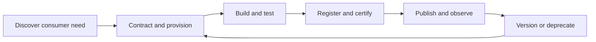

# Azure Databricks Data Mesh

[Architecture overview](README.md) · [Data-mesh diagram](../diagrams/data-mesh-operating-model.md) · [Product contract example](../contracts/data-product-contract.example.yaml) · [Roadmap phases 11–20](../roadmap/phases-11-20.md)

## Operating model

Data mesh is not a framework installation. This platform implements four connected principles:

1. **Domain ownership:** Customer, Product, Commerce, Payment/Risk, Supply and Engagement teams own the meaning, pipelines, quality, SLO, support and evolution of their products.
2. **Data as a product:** Published data is designed for named consumers and must be discoverable, understandable, addressable, interoperable, secure, trustworthy and supported.
3. **Self-service data platform:** A platform team supplies approved Azure/Databricks landing zones, templates, pipelines, catalog integration, access workflow, observability and cost controls.
4. **Federated computational governance:** Domain representatives and central platform/security/governance owners define global rules and automate them through contracts, CI, policy and runtime controls.

## Responsibility model

| Role | Owns | Does not own |
|---|---|---|
| Domain product team | Business semantics, sources, transformations, contract, quality, SLO, documentation, support and lifecycle | Enterprise landing-zone engineering or all global policies |
| Data-product owner | Product purpose, users, roadmap, acceptance, risk/SLO/cost trade-offs | Every implementation task personally |
| Self-service platform team | Azure/Databricks foundations, paved-road templates, common messaging/connectors, observability and access workflow | The business meaning of every product |
| Federated governance council | Interoperability, documentation, security, privacy, quality, lifecycle and compliance standards | Manual approval of every ordinary domain release |
| Consumer | Approved purpose, access, usage constraints, dependency registration and feedback | Uncontracted assumptions or unmanaged copies |

In a one-person learning project, represent these roles with ownership manifests, CODEOWNERS, distinct identities/groups, product contracts, tests, runbooks and approval evidence.

## Azure reference architecture

## Platform capability map

| Capability | Azure/Databricks implementation | Local equivalent |
|---|---|---|
| Identity | Entra groups, managed identities, service principals and workload federation | Local users/service accounts and generated test identities |
| Network/secrets | Private endpoints/DNS, Key Vault, encryption and diagnostics | Isolated Docker/Kubernetes networks and secret files excluded from Git |
| Streaming | Event Hubs Kafka endpoint or managed Kafka, Schema Registry and raw archive | Kafka KRaft, Kafka Connect/Debezium and schema registry |
| Batch ingestion | Metadata-driven Azure Data Factory copy/connectors | Scheduled Python/Spark loaders |
| Storage | ADLS Gen2 and Unity Catalog managed/external locations | S3-compatible object storage and Delta/Iceberg-compatible tables |
| Processing | Azure Databricks, Lakeflow pipelines/jobs, Auto Loader and AUTO CDC | Spark Structured Streaming/batch jobs |
| Governance | Unity Catalog plus Microsoft Purview | Contracts, policy files and optional OpenMetadata/DataHub |
| Consumption | Databricks SQL, Power BI, OpenSharing, Feature Engineering, MLflow and serving | Spark SQL/local BI, MLflow and local services |
| Operations | Azure Monitor/Log Analytics and Databricks system tables | OpenTelemetry, Prometheus/Grafana and logs |
| Provisioning | Terraform/Bicep and Declarative Automation Bundles | Terraform and reproducible bootstrap scripts |

## Self-service platform products

| Platform product | Provisioned capability | Guardrail |
|---|---|---|
| Domain onboarding | Groups, repo scaffold, ownership, environments, cost tags and support route | Naming, ownership and environment policy |
| Data landing zone | Resource group/subscription, network, ADLS, keys, diagnostics and budgets | Private access, encryption, tags and deletion protection |
| Databricks scaffold | Catalog/schema/storage, identity grants, pipeline/job, tests and runbook | Unity Catalog, approved compute policy and CI |
| Common messaging | Topic/event hub, partitions, retention, schema, ACLs, quotas and dashboards | Contract, classification, replay and capacity policy |
| Batch connector factory | Parameterized ADF full/incremental/CDC landing | Managed identity, state, checksum, retry, delete and lineage rules |
| Contract registry | Product/schema versions, consumers, dependencies and deprecation notices | Compatibility and completeness gates |
| Catalog/discovery | Owner, glossary, classification, lineage, samples, certification and access | Required metadata and authoritative-field policy |
| Quality/observability | Expectations, freshness/volume monitors, alerts and incident templates | Minimum quality dimensions and SLOs |
| Secure access | Purpose-bound group request, approval, grant/mask/filter and expiry | Least privilege, recertification and audit |
| CI/CD and FinOps | Tested promotion, compute/storage policy, budget and product cost | Immutable artifacts, rollback and cost attribution |

Platform success is measured by onboarding lead time, deployment frequency, reliability, adoption, support burden and cost—not the number of resources created.

## Data-product types

| Type | Purpose | Example |
|---|---|---|
| Source-aligned | Faithful governed analytical representation of a source domain | Customers SCD2, order events and stock movements |
| Aggregate | Stable domain fact, dimension, metric or feature | Net revenue, inventory availability and price history |
| Consumer-aligned | Contracted combination for a named decision | Marketing journey, enterprise customer 360 and demand feature set |
| Shared reference | Controlled vocabulary used across domains | Currency, country, market, calendar and status mapping |

A table is not automatically a product. A product groups one or more assets that solve a consumer outcome and exposes supported ports under one contract.

## Product contract requirements

Every product contract defines:

- ID, name, domain, type, purpose and version.
- Business owner, technical owner, support/on-call and escalation.
- Named consumers, approved purpose, access method and review/end date.
- Input and output ports with address, protocol, format, schema and compatibility.
- Grain, keys, semantics, units, currency, timezone and event-time meaning.
- Freshness, availability, completeness, latency, recovery and error-rate SLOs.
- Quality rules, thresholds, quarantine/failure action and reconciliation source.
- Classification, PII, consent/purpose, retention, deletion, masks/filters and audit.
- Lineage, dependencies, runbook, dashboards, cost owner and budget.
- Change log, deprecation date, successor, migration window and deletion approval.

Contracts live beside code, validate in CI and register into discovery/governance systems. See the [example contract](../contracts/data-product-contract.example.yaml).

## Input and output ports

| Need | Pattern | Rule |
|---|---|---|
| Transactional change | Outbox/Debezium to the chosen Kafka-compatible backbone | No application database/event dual write |
| Behavioral stream | Versioned producer with schema registry | Contract key, time, partition, retention and PII |
| External database/SaaS | Metadata-driven ADF incremental/CDC connector | State, delete handling, checksum and restart |
| Historical file | ADF/Auto Loader to immutable landing | Snapshot ID, checksum, schema and provenance |
| Operational lookup | Owning service API or read model | Keep the lakehouse out of critical transactions |
| Analytical publication | Unity Catalog Delta/view, SQL, approved API or OpenSharing | Identity, row/column policy, version, SLO and usage audit |

The platform preserves both streaming and batch/replay access without making each application write both an event and a blob. A governed consumer archives the event stream into ADLS/Delta.

## Medallion inside each domain

| Layer | Product behavior | Required controls |
|---|---|---|
| Bronze | Lossless and replayable source record | Source position, contract version, payload preservation, corruption quarantine and retention |
| Silver | Trusted, deduplicated and conformed domain state/event | Type normalization, CDC/deletes, SCD rules, late data, quality and source reconciliation |
| Gold | Stable business aggregate/consumer product | Declared grain, semantics, SLO, owner, cross-domain dependency contracts and certification |

Medallion describes increasing quality; data mesh describes ownership and product behavior. Use both.

## Initial product inventory

| Domain | Silver products | Gold/feature products |
|---|---|---|
| Customer | Customers/addresses SCD2, consent and status events | Customer dimension, customer 360 and engagement daily |
| Product | Products/categories/prices SCD2 and brands | Product dimension, price-status KPIs and quality score |
| Commerce | Carts/items, orders/items, returns and payment outcomes | Order/payment facts, net revenue and checkout funnel |
| Supply | Warehouses, stock snapshots/movements, reservations and shipments | Inventory daily, stockout KPIs, fulfillment and demand training set |
| Engagement | Sessions, views, campaign events and support interactions | Conversion, campaign, support and churn training products |
| AI feedback | Predictions, impressions, agent traces and human feedback | Model, RAG and agent outcome metrics |

## Purview and Unity Catalog

| Concern | Microsoft Purview | Unity Catalog |
|---|---|---|
| Enterprise discovery | Primary cross-platform catalog and search | Databricks-scoped discovery |
| Glossary/domain organization | Business terms, domains, products and workflows | Technical comments/tags linked to governed assets |
| Classification | Enterprise classification and scanning | Governed tags, masks/filters and permissions |
| Runtime access | Access workflow may initiate request | Enforces Databricks grants, ABAC, row filters and views |
| Lineage | Enterprise lineage view where integrated | Databricks runtime technical lineage |

Declare one authoritative system for each metadata attribute and reconcile integrations. Do not maintain two conflicting owners, classifications or lifecycle states.

## Federated policy set

Global policies cover interoperability, documentation, security, privacy, quality, compliance, lifecycle, SLO/support and FinOps. Domain teams remain authoritative for domain-specific semantics and quality thresholds that exceed the global minimum.

Automate policies through Terraform/Bicep, Unity Catalog grants/ABAC, contract CI, Lakeflow expectations, scanners, access expiry, deployment gates and audit queries.

## Product lifecycle

Deprecation identifies consumers from lineage/usage, sends notice, provides a successor and migration window, blocks new consumers, archives where required and deletes only after policy approval.

## Data-mesh release gate

- A domain onboards through versioned self-service modules without manual cloud configuration.
- A consumer discovers, understands, requests and validates a product without undocumented producer knowledge.
- Contract, schema, quality, security, lineage and SLO tests pass.
- Duplicate/update/delete/late-event fixtures yield exact Silver state.
- Gold totals reconcile to authoritative ledgers.
- Product incidents are detected, traced, communicated, recovered and costed.
- Product versioning and deprecation are demonstrated safely.

