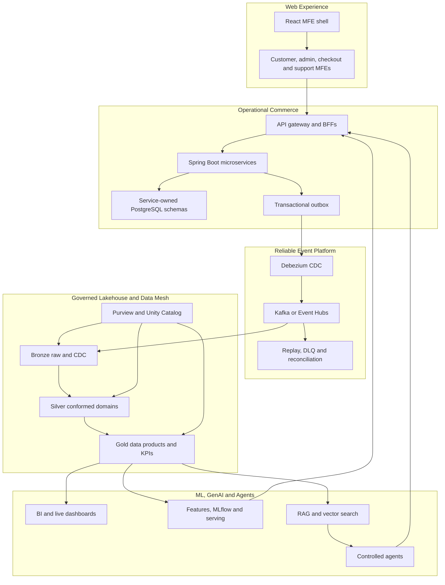

# Retail Intelligence Platform - End-to-End Architecture

This project is a clean new start for `retail-intelligence-ecommerce`.
It uses a web-only frontend with React and TypeScript MFEs, Spring Boot
microservices, reliable events, and an Azure Databricks data mesh. There is no
Flutter or mobile track.

## Architecture Diagram

The critical production rule is simple: analytics, ML and agents never update
operational databases directly. Every proposed action returns through the BFF
and the owning microservice API.

## Roadmap Summary

| Milestone | Phases | Lessons | Outcome |
|---|---:|---:|---|
| Web MFE and transactional microservices | 1-7 | 35 | React shell, MFEs, BFFs, Spring Boot services, databases, checkout, payment, inventory, fulfillment, CMS and CRM |
| Reliable event platform | 8-10 | 15 | Kafka/Event Hubs contracts, transactional outbox, Debezium CDC, sagas, replay, reconciliation and 20M to 100M testing |
| Governed lakehouse and data mesh | 11-15 | 25 | ADF, ADLS, Bronze/Silver/Gold, domain products, contracts, Purview, Unity Catalog, KPIs, quality, lineage and BI |
| ML and deep learning | 16-20 | 25 | Features, forecasting, recommendations, deep learning, MLflow, serving, experimentation and monitoring |
| GenAI and agentic AI | 21-23 | 15 | LLM evaluation, RAG, multimodal processing, AI Search, governed tools, approvals and controlled agents |
| Production capstone | 24 | 5 | Terraform/Bicep, CI/CD, security, resilience, DR, FinOps and production-readiness testing |
| Total | 1-24 | 120 | Complete end-to-end implementation |

## Key Production Decisions

- Operational microservices remain the systems of record.
- Each microservice owns its writable database schema and Flyway migrations.
- MFEs communicate through BFF/domain APIs, not databases, Kafka or Databricks.
- A database update and outbox record are committed in one transaction.
- Treat end-to-end event delivery as at least once. Use event IDs, idempotent consumers, deduplication and reconciliation.
- Use one authoritative event backbone per stream after local Kafka and Azure compatibility testing.
- Every domain data product needs an owner, consumer, contract, schema, semantics, quality rules, SLO, security classification, lineage, cost and lifecycle.
- Databricks organizes governed products through Bronze, Silver and Gold layers.
- Purview handles enterprise discovery, glossary and classification; Unity Catalog governs Databricks permissions, assets and lineage.
- Data mesh means domain ownership, data as a product, a self-service platform and federated governance.
- ML begins with deterministic and classical baselines before deep learning.
- RAG preserves source permissions, freshness, deletion and citations.
- Agents use typed, least-privileged domain API tools. Sensitive actions require policy checks or human approval.

## Imported Tree Decisions

The scaffold keeps the useful source directories from the previous tree, such as
`data-quality`, `config/local`, `applications/backend/api-gateway`,
`ingestion/kafka-connect`, `orchestration/airflow`, `infrastructure/monitoring`,
and `source-system/public-datasets`.

Generated and local runtime directories are intentionally excluded from source:
`build`, `__pycache__`, `metastore_db`, `spark-warehouse`, `tmp`, `logs`,
`secrets`, test reports, local warehouses and generated datasets.
