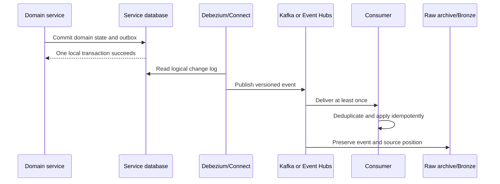
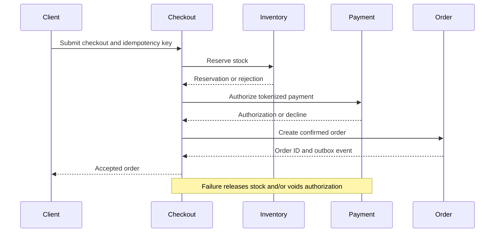

# Reliable Event Platform

[Architecture overview](README.md) · [Event envelope example](../contracts/canonical-event-envelope.example.json) · [Roadmap phases 1–10](../roadmap/phases-01-10.md)

## Purpose

The event platform publishes completed domain facts reliably, decouples asynchronous consumers, enables replay and supplies a governed input port for the data mesh. Kafka/Event Hubs is not used to replace every synchronous API.

## Transaction-to-event flow



Do not write the database and call the producer as two unrelated operations. The outbox record is committed with the aggregate change and Debezium publishes it from the database log.

## Canonical event envelope

| Field | Requirement |
|---|---|
| `event_id` | Globally unique and stable deduplication key |
| `event_type` | Business fact name in past tense |
| `event_version` | Contract version with a declared compatibility policy |
| `aggregate_type` / `aggregate_id` | Ownership, partitioning and per-aggregate ordering |
| `occurred_at` | Business event time in UTC |
| `published_at` | Transport publication time in UTC |
| `producer` | Owning service and deployed version |
| `trace_id` / `correlation_id` / `causation_id` | End-to-end diagnosis and causal chain |
| `tenant_id` / `market_id` | Isolation and routing where required |
| `classification` | Public, internal, confidential or restricted |
| `schema_ref` | Registry subject/version or immutable schema reference |
| `payload` | Versioned, minimal business fact without prohibited secrets |

Use Avro or Protobuf with Schema Registry for core contracts. JSON requires JSON Schema and automated compatibility tests. Payment-card data, secrets and unnecessary PII are prohibited.

## Topic/event-hub design

Define names, owner, aggregate key, partitions, ordering scope, retention, compaction, replication/resilience, quotas, maximum record size, schema subject, producer/consumer ACLs, replay policy and SLO before creation.

Example convention:

```text
<environment>.<domain>.<aggregate>.<event-family>

dev.customer.customer.lifecycle
prod.commerce.order.lifecycle
prod.supply.inventory.movement
```

Key by aggregate ID when consumers require ordered state transitions for that aggregate. Never assume global event ordering.

## Local and Azure backbone decision

| Option | Use | Required evidence |
|---|---|---|
| Apache Kafka KRaft | Local development and Kafka-specific learning | Deterministic bootstrap, persistence, security and replay tests |
| Azure Event Hubs Kafka endpoint | Azure-native managed streaming | Client, Connect/Debezium, protocol feature, transaction, retention, performance and cost compatibility |
| Managed Kafka | When native Kafka behavior/operations are required | Availability, security, connector, recovery, capacity and cost comparison |

Choose one authoritative backbone per stream. Do not dual-publish the same business fact from application code merely to support two platforms.

## Producer and consumer semantics

### Producer

- Use `acks=all`/equivalent durability, idempotent producer settings, bounded retries and explicit timeouts where the selected backbone supports them.
- Use a stable event ID and aggregate key.
- Propagate trace/correlation metadata.
- Monitor publish failures, outbox backlog and outbox-to-bus latency.

### Consumer

- Persist processed event IDs or an inbox record when side effects require deduplication.
- Commit offsets/checkpoints only after durable processing.
- Make external side effects idempotent with stable idempotency keys.
- Retry transient failures with bounded exponential backoff.
- Quarantine poison records with ownership, reason, payload reference and replay procedure.
- Reconcile business ledgers; Kafka producer idempotence is not business exactly once.

## CDC and raw archival

Preserve source database, table, operation, transaction/source position, before/after data as permitted, delete/tombstone behavior, event contract version, topic/partition/offset and ingestion timestamps. The archive is append-oriented, classified and retention-controlled.

Application services do not perform a second blob write. A governed platform consumer lands the authoritative stream into ADLS/Bronze for replay and lineage.

## Checkout saga



Persist saga state. Commands, provider callbacks and compensations are idempotent. Timeouts and ambiguous provider outcomes enter reconciliation rather than guessing success or failure.

## Replay and reconciliation

Replay is an operated procedure:

1. Identify source range, event contract versions and affected consumers.
2. Stop or isolate conflicting live processing where required.
3. Restore/reset consumer state safely.
4. Replay to a shadow target first for high-impact data.
5. Compare counts, amounts, state transitions and rejected records.
6. Promote/reconcile and retain an audit record.

Scheduled reconciliation compares order, payment, inventory, shipment, outbox, event-bus and Bronze totals. Differences have thresholds, ownership and incident severity.

## Verification gate

Inject crashes, duplicates, out-of-order events, poison records, deletes, schema changes, checkpoint loss, consumer restart, provider timeout and replay. Correct state must converge, prohibited data must not leak and reconciliation must detect unresolved differences.

