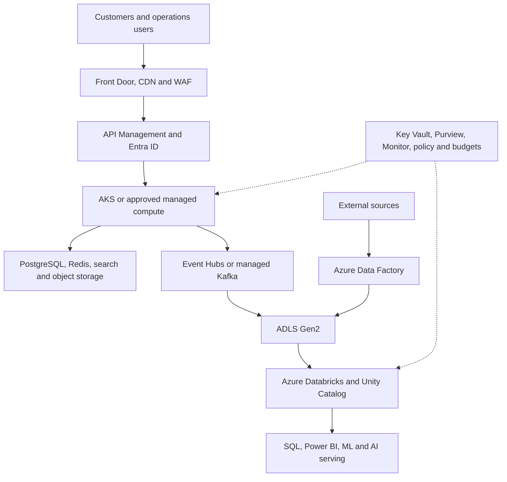

# Deployment, Security and Production Operations

[Architecture overview](README.md) · [Production readiness](../operations/production-readiness.md) · [Roadmap phases 21–24](../roadmap/phases-21-24.md)

## Environment topology

| Environment | Purpose | Topology |
|---|---|---|
| Local | Learn, implement, test and reproduce | WSL2, React MFE hosts, Spring Boot, Docker Compose/Kubernetes, PostgreSQL, Kafka KRaft, Redis, optional OpenSearch/object storage and Spark/Delta |
| Integration/QA | Contract, CDC, data, security and performance verification | Azure dev/test landing zone, APIM routes, managed compute, non-production event namespace, ADLS, Azure Databricks catalogs, Purview integration and provider sandboxes |
| Production | Customer traffic and governed data/AI products | Front Door/WAF, static MFE origins/CDN, APIM/BFF, Entra ID, AKS/managed compute, PostgreSQL/Redis, event backbone, ADF, ADLS, Azure Databricks/Unity Catalog, Purview, private networking, Key Vault and Monitor |

## Production Azure topology

## Identity and network security

- Entra ID OIDC/OAuth 2.x for users; PKCE for the web client.
- Managed identities, service principals and workload federation for services/pipelines.
- Short-lived credentials; secrets stored in Key Vault and never committed.
- Private endpoints/DNS for data services and restricted egress where feasible.
- Least-privilege PostgreSQL roles, event-bus ACLs, ADLS RBAC/ACLs, Unity Catalog grants/ABAC and model/tool permissions.
- Environment, domain, tenant/market and purpose isolation enforced below the prompt/UI layer.
- TLS in transit, encryption at rest, tokenized payment data, signed provider webhooks and audited privileged access.

## Privacy and data protection

- Classify fields and minimize PII in APIs, events, tables, features, indexes and traces.
- Apply consent, purpose, retention, access, correction, export and deletion across operational stores, lakehouse, feature store, indexes, model/agent traces and backups.
- Use governed tags, row filters, column masks/dynamic views, pseudonymization and privacy-aware logs.
- Keep payment-card data with the provider; do not copy it into events, Delta, prompts or telemetry.
- Record lineage and deletion evidence; acknowledge systems with delayed purge/backup expiration in the policy.

## CI/CD paths

| Path | Required stages |
|---|---|
| Web MFE | Lint/type/unit → component/accessibility → API contract → composition/E2E → bundle/performance → SAST/dependency/SBOM → immutable assets → canary/rollback |
| Microservice | Lint/unit → component → provider/consumer contract → integration → migration/security → signed image/SBOM → QA → canary/blue-green → rollback |
| Database | Flyway validation → disposable migration test → backward-compatible deploy → verification → later cleanup migration |
| Event contract | Schema/semantic compatibility → examples → producer/consumer tests → registry/catalog publish → consumer notification |
| Data product | Contract → PySpark/SQL unit → test catalog/pipeline → quality/security/lineage/reconciliation/SLO → certification → production deploy → observation |
| ML | Reproducible train → offline evaluation → registry → approval → shadow/canary/A-B → monitor → promote/rollback |
| RAG/agent | Prompt/tool/retrieval version → golden/adversarial/privacy/security evaluation → staged traffic → quality/safety/cost monitoring → kill/rollback |
| Infrastructure | Format/validate → plan → policy/security/cost checks → reviewed apply → smoke/DR checks → drift monitoring |

## Initial service/data objectives

These are engineering starting points, not contractual promises. Validate with business requirements and tests.

| Path | Initial objective |
|---|---|
| Catalog/cart API | Platform-boundary p95 under 300 ms |
| Checkout acceptance | p95 under 2 s excluding external-provider delay; idempotent retry |
| Outbox-to-event backbone | p95 under 5 s |
| Streaming Bronze freshness | Under 2 minutes |
| Near-real-time Silver facts | Under 5 minutes where justified |
| Gold dashboards | 15–60 minutes by KPI |
| Online recommendation | p95 under 150 ms with deterministic fallback |
| RAG support response | p95 under 5 s with timeout/fallback |
| Recovery | Service/product-specific RTO/RPO tested; payment/order ledgers receive strict objectives |

## Observability model

Correlate:

- Browser session/navigation and web vitals.
- Gateway/BFF/service spans and logs.
- Database query, pool, lock and migration telemetry.
- Outbox backlog, connector health, event rate, lag, retries and quarantine.
- ADF/Lakeflow job/pipeline state, checkpoints, freshness, volume and quality.
- Unity Catalog lineage, access/audit and downstream dependency impact.
- SQL/warehouse/model endpoint latency, throughput, error and cost.
- Model drift/quality/calibration and prediction-to-outcome metrics.
- RAG retrieval/answer/citation and agent plan/tool/outcome/safety/cost traces.

Every alert maps to an owner, SLO, severity, runbook, escalation and recovery verification. Avoid alerts without an actionable response.

## Reliability and disaster recovery

Define per service/product:

- Availability and error budget.
- Backup frequency, retention and encryption.
- RPO and RTO.
- Zone/region failure behavior.
- Database restore and point-in-time recovery.
- Event retention, offset/checkpoint recovery and replay.
- ADLS/Delta restore/version/time-travel limitations.
- Rebuild procedures for Redis, OpenSearch, feature/index projections and semantic caches.
- Deployment rollback and forward-fix rules.
- Provider outage, timeout and reconciliation behavior.

Test restores and failover. A documented backup that has never restored is not production evidence.

## FinOps

- Tag resources by environment, domain, product, owner and cost center.
- Allocate/show back Databricks compute, SQL warehouses, ADF activity, event throughput, ADLS storage/transactions and observability costs.
- Enforce approved compute policies, autoscaling, idle shutdown, retention and budget alerts.
- Monitor cost per product, pipeline run, million events, dashboard/model request and agent task where useful.
- Review performance/cost trade-offs before adding real-time features, GPUs, vector indexes or multi-agent workflows.

## Production test matrix

| Area | Minimum tests |
|---|---|
| Application | Unit, component, API contract, integration, E2E, accessibility and performance |
| Transactions | Idempotency, concurrency, saga compensation and reconciliation |
| Events | Compatibility, duplicate, ordering, restart, poison, delete, replay and retention |
| Data | Unit, CDC/SCD, quality, late data, backfill, schema, lineage, reconciliation and SLO |
| Security/privacy | AuthN/AuthZ, tenant/purpose, secrets, PII, deletion, dependency and penetration tests |
| Resilience | Load, soak, chaos, provider outage, backup/restore, zone failure and rollback |
| ML | Leakage, baseline, split, reproducibility, drift, fairness, latency and business outcome |
| RAG/agents | Retrieval, groundedness, citation, ACL, prompt injection, tool abuse, approval and cost |

## Release gate

Production is approved only when all milestone evidence exists, contracts/ADRs/docs match deployed behavior, residual risks have owners and deadlines, rollback/recovery is demonstrated and operations can identify the current version, health, dependencies, cost and support owner for every critical service/data product/model/agent.

