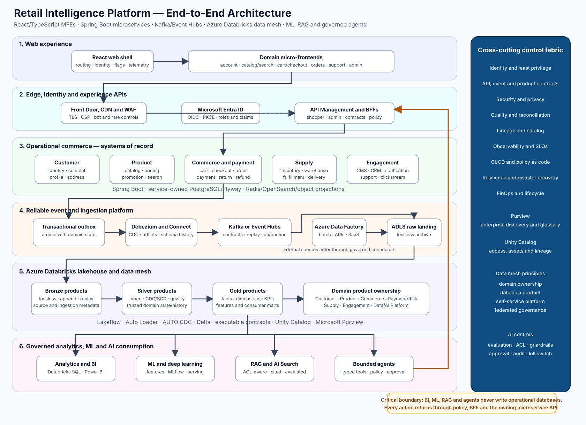
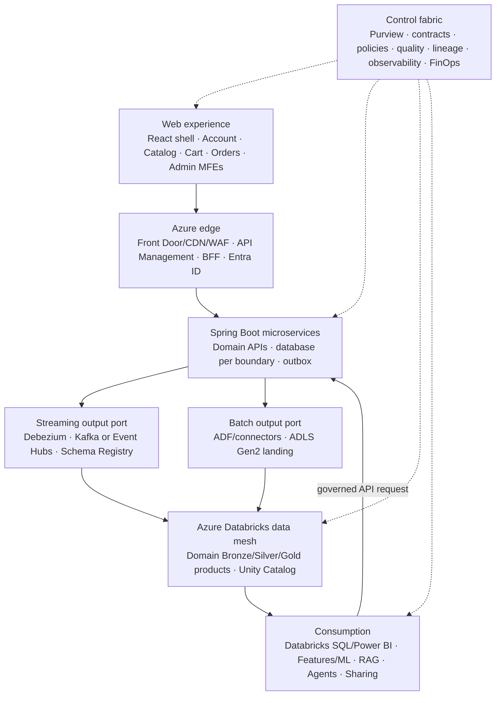
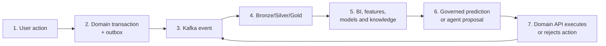
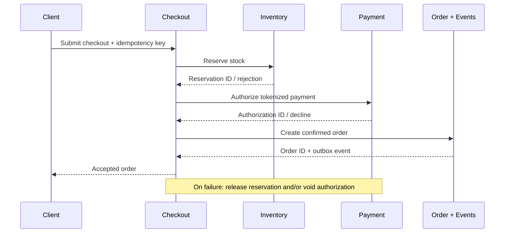
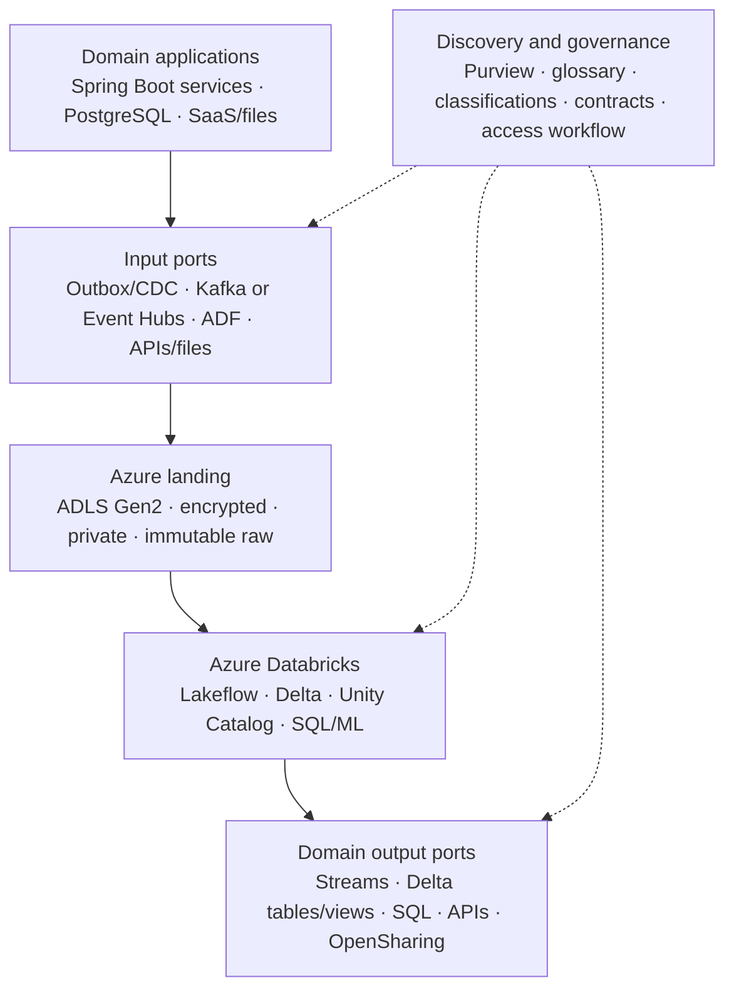
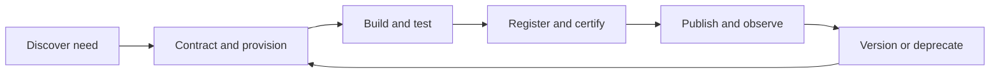
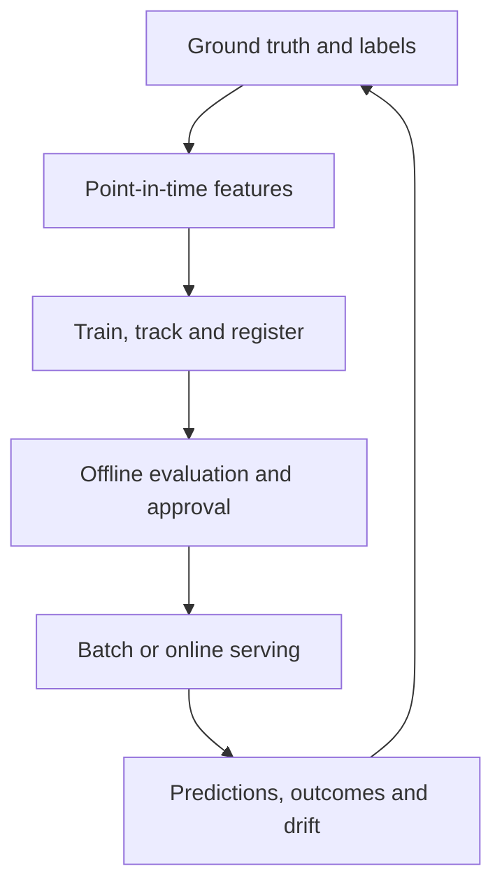
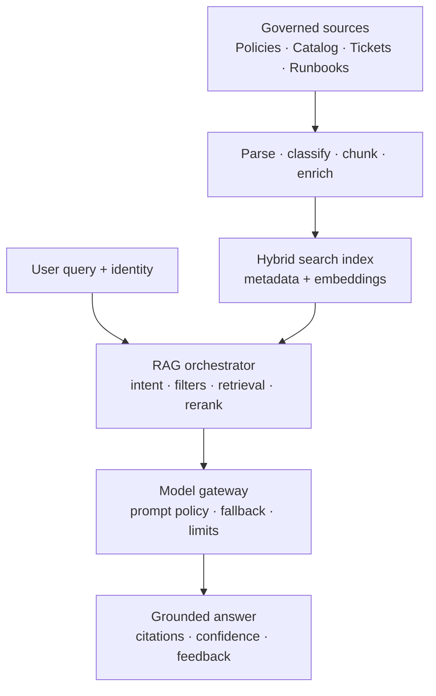

# Retail Intelligence Platform

## End-to-End Web MFE, Microservices, Azure Databricks Data Mesh and 120-Lesson Implementation Roadmap

**Prepared:** 2 September 2026  
**Revision:** 3 — clean-start, commit-ready documentation for web-only frontend, micro-frontends, microservices, and domain-owned data products  
**Architecture style:** Web micro-frontends + domain microservices + event-driven integration + Azure Databricks data mesh + ML/Deep Learning + GenAI/RAG + governed agentic AI  
**Target scale:** 20M+ records locally, expandable to 100M+ records and production streaming workloads  
**Primary implementation languages:** TypeScript/React, Java/Spring Boot, Python/PySpark, SQL, Terraform/Bicep  
**Explicit scope:** Web frontend only; no mobile-application track is part of this roadmap.  

---

## 0. Start here

This document is the searchable source of truth for the new repository `retail-intelligence-ecommerce`. Create the repository, verify the workstation and begin at `L001`:

```bash
mkdir -p "$HOME/projects"
cd "$HOME/projects"
chmod +x "$HOME/Downloads/create-retail-intelligence-ecommerce.sh"
"$HOME/Downloads/create-retail-intelligence-ecommerce.sh" "$HOME/projects"
cd "$HOME/projects/retail-intelligence-ecommerce"
scripts/validation/validate-structure.sh
```

Then follow [Installation](../getting-started/installation.md), [Implementation workflow](../getting-started/implementation-workflow.md), [Learning evidence](../learning/README.md) and the [progress tracker](../learning/progress-tracker.md). The final vector architecture is [end-to-end-architecture.svg](../diagrams/end-to-end-architecture.svg).

Execution starts with architecture and ownership in Phase 1, not with every container or service. Phase 2 pins tools and creates a reproducible environment. The first runnable business slice is the Catalog MFE/BFF/service/database path; events, lakehouse, ML and AI are added in their planned phases after the previous evidence gates pass.

---

## 1. Executive architecture decision

Build the platform as three connected planes and one control fabric:

1. **The web experience plane** contains a React/TypeScript application shell and independently deployable micro-frontends (MFEs) for account, catalog/search, cart/checkout, orders/fulfillment, support, and administration. MFEs never access a database, Kafka/Event Hubs, or Databricks directly; they use versioned BFF/domain APIs.
2. **The operational commerce plane** contains Spring Boot microservices that own customer, catalog, pricing, cart, checkout, payment, order, inventory, fulfillment, CMS, CRM, notification, and support transactions. Each service owns its schema/database boundary and publishes facts through an outbox.
3. **The data and intelligence plane** is an Azure Databricks data mesh. Domain teams own discoverable, trustworthy data products; a platform team supplies reusable Azure/Databricks capabilities; a federated governance group defines and automates global standards. The same governed products serve BI, ML/Deep Learning, RAG, and agents.

The **control fabric** applies identity, security, data contracts, privacy, quality, lineage, observability, CI/CD, SRE, and FinOps across all three planes.

The planes connect through versioned APIs, domain events, CDC, and governed data-product output ports. The intelligence plane may recommend or propose an action, but every state change must go back through the owning microservice. It must never write directly to an operational database.

This design supports the complete learning curve requested: web frontend, MFE composition, microservices, database design, Kafka/Azure Event Hubs, CDC, batch and streaming data engineering, data mesh, Azure, Databricks, analytics, data science, machine learning, deep learning, Generative AI, LLMs, RAG, multimodal systems, agentic AI, MLOps, LLMOps, security, governance, deployment, and production operations.

### Non-negotiable boundaries

- The checkout path does not query the lakehouse.
- MFEs are presentation deployments, not new systems of record. An MFE calls its BFF or owning domain API and does not bypass microservice boundaries.
- Microservices do not share writable tables. Cross-domain reads use APIs, events, or certified data products according to latency and consistency needs.
- Payment card data is tokenized by the payment service provider; it is not copied into Kafka, Delta tables, prompts, traces, or vector indexes.
- Kafka is used for asynchronous facts and workflows, not as a replacement for every synchronous API.
- A service updates its own database and outbox in one local transaction; Debezium publishes the outbox record.
- Delivery is treated as at-least-once end to end. Consumers use stable event IDs, idempotency keys, inbox/deduplication records, and reconciliation jobs.
- ML or LLM output is not business truth. Orders, prices, balances, inventory, consent, and payment status remain authoritative in their domain services.
- Agents call allow-listed tools backed by domain APIs. Refunds, price changes, customer-data disclosure, supplier communication, and other high-impact actions require policy checks and, where appropriate, human approval.
- Data mesh is an operating model, not a product installation. Domain ownership, data-as-a-product, a self-service platform, and federated computational governance must all be evidenced.
- A domain data product has an owner, purpose, consumers, input/output ports, semantic contract, quality rules, SLOs, classification, lineage, cost, support, version, and deprecation policy.
- Microsoft Purview provides enterprise discovery, glossary, classification, and governance workflows; Unity Catalog governs Databricks data/AI assets, runtime permissions, and lineage. Each metadata field has one declared authority to avoid conflicting catalogs.
- Local development uses Apache Kafka. The Azure target chooses either Azure Event Hubs through its Kafka endpoint or a managed Kafka service through an ADR and compatibility test; do not operate two authoritative event backbones for the same stream.
- Start with deterministic workflows, then classical ML, then deep learning, then GenAI, and only then agentic orchestration.
- Scale is demonstrated with rows, event rates, partitions, concurrency, and data products—not by creating 100,000 low-value tables.

---

## 2. How the supplied references influence this design

| Reference | Idea retained | Production refinement in this design |
|---|---|---|
| [Data Mesh Architecture with Azure and Databricks](https://blog.nashtechglobal.com/data-mesh-architecture-with-azure-and-databricks/) | The four mesh principles are domain ownership, data as a product, self-service data platform, and federated governance. Domain products publish contracts and can expose batch and streaming output ports using Azure services and Databricks. | Apply the ideas to retail domains, not only Cart/Checkout/Marketing. Replace manual agreements with versioned contract manifests and CI gates; use ADLS Gen2/Delta rather than uncontrolled JSON copies; separate Purview enterprise metadata from Unity Catalog enforcement; choose one event backbone; and make quality, lineage, security, SLOs, observability, lifecycle, and cost executable. |
| [Emerging Architecture and Stack for LLM Apps](https://www.linkedin.com/pulse/emerging-architecture-stack-llm-apps-rabee-zyoud/) | LLM applications need orchestration, multiple model choices, and enterprise knowledge sources. | The orchestration layer is framework-neutral; model gateways, evaluations, security, lineage, fallbacks, and cost controls are first-class components. |
| [The GenAI Reference Architecture](https://dr-arsanjani.medium.com/the-genai-reference-architecture-605929ab6b5a) | UI/UX, prompt engineering, RAG, serving, adaptation, data preparation, grounding, multi-agent systems, governance, and MLOps are separate architectural capabilities. | Not every application receives every capability. Components are introduced only when a measured use case justifies their cost and risk. |
| [Classification of Deep Learning Architecture](https://www.researchgate.net/figure/Classification-of-deep-learning-architecture_fig1_334946670) | Deep learning architectures can be viewed as discriminative, generative, or hybrid. | Model choice begins with the business objective, labels, latency, data volume, explainability, and baseline performance; architecture fashion is not the selection criterion. |
| [Architecture of a Real-World Machine Learning System](https://medium.com/louis-dorard/architecture-of-a-real-world-machine-learning-system-795254bec646) | A production ML system needs ground truth, labeling, evaluation, monitoring, feature computation, orchestration, model building, serving, and application integration. | Those functions are mapped to Delta data products, Feature Store, MLflow, Model Serving, feedback events, deployment gates, and business KPIs. |
| [Demystifying AI in B2B Ecommerce](https://oroinc.com/b2b-ecommerce/blog/demystifying-ai-in-b2b-ecommerce/) | Data readiness and a valid use case matter more than adding AI everywhere; some problems are cheaper and safer as rules. | Every AI use case must beat a deterministic baseline and pass value, risk, latency, privacy, and operational-readiness gates. |
| Supplied agent diagram | Perception, cognition, memory/knowledge, decision, action, and monitoring form the agent loop. | Add identity, tool authorization, data entitlements, human approval, transaction boundaries, traceability, evaluation, cost limits, and a kill switch around the loop. |

---

## 3. Overall end-to-end architecture





### 3.1 Request-to-learning feedback loop



1. A user acts in a domain MFE; the shell supplies navigation, identity, design tokens, telemetry, and failure isolation.
2. The MFE calls a BFF/domain API. The owning Spring Boot microservice validates the command and atomically commits its state plus an outbox record.
3. Debezium publishes the outbox record to the chosen Kafka-compatible backbone. Consumers process it idempotently; raw events are archived for replay.
4. A domain-owned Lakeflow pipeline ingests its input ports into Bronze, reconstructs trusted Silver entities, and publishes certified Gold products through Unity Catalog.
5. Purview makes products discoverable across the enterprise; product contracts state meaning, schema, quality, SLOs, access, lineage, lifecycle, and support.
6. BI users, other domains, ML pipelines, RAG systems, and agents consume only approved output ports using their own identities and purpose-scoped access.
7. A model or agent may propose an action, but policy invokes the owning microservice API. The resulting event becomes measurable feedback and closes the loop.

---

## 4. Operational commerce capability map

### 4.1 Web MFE composition

| Deployable | Business scope | Backend boundary | Independence and contract rule |
|---|---|---|---|
| `web-shell` | Routing, top-level layout, authentication bootstrap, navigation, feature flags, error boundary, telemetry | Experience/BFF endpoints only | Own release; minimal shared runtime; no business state ownership |
| `account-mfe` | Sign-up/sign-in, profile, address, consent, preferences | Identity/Customer service | Versioned API client generated from OpenAPI; no direct import from another MFE |
| `catalog-mfe` | Browse, search, product details, pricing/promotion display | Catalog, Pricing, Search BFF | Cache and SEO rules are explicit; price truth stays in Pricing |
| `cart-checkout-mfe` | Cart, quote, checkout, payment handoff | Cart and Checkout BFF | Idempotency key is maintained across retries; no payment secret is stored in browser state |
| `orders-mfe` | Order history, shipment and return status | Order, Fulfillment, Support BFF | Uses authoritative operational read APIs, not Databricks tables |
| `support-mfe` | Knowledge search, ticket creation, governed assistant | Support and AI gateway APIs | RAG citations and escalation are visible; tool actions follow service authorization |
| `admin-mfe` | Catalog, pricing, inventory, campaign, support operations | Purpose-specific admin BFFs | Separate Entra roles; sensitive changes require audit/approval |

Use route-based composition first and runtime module federation only where independent release is valuable. Share design tokens, identity/session helpers, telemetry, and generated contract types; do not build a large shared business library that couples all MFEs. Cross-MFE communication uses URL state, shell-owned context, or small versioned browser events. Each MFE has an error boundary, performance budget, accessibility checks, contract tests, and independent deployment/rollback.

### 4.2 Microservice and data-domain ownership

For local learning, one PostgreSQL cluster with isolated schemas, owners, and least-privilege roles is acceptable. Every Spring Boot service still receives a unique database credential and owns migrations for only its schema. In production, bounded contexts may move to separate databases or clusters when isolation, scale, blast radius, or regulatory requirements justify it.

Application and data ownership align, but they are not identical artifacts: a domain team owns its microservice APIs/events and the analytical data products derived from them; the platform team owns reusable infrastructure, templates, and guardrails.

| Data domain | Operational microservices | Representative domain products | Primary output ports |
|---|---|---|---|
| Customer | Identity, Customer, Consent | Customer history, consent ledger, customer 360 | API, Kafka/Event Hubs topics, Delta tables/views |
| Product | Catalog, Pricing, Promotion, Search projection | Product master, price history, catalog quality | API/search projection, events, Delta, SQL |
| Commerce | Cart, Checkout, Order, Return | Cart funnel, orders, returns, net revenue | APIs, events, certified facts/dimensions |
| Payment/Risk | Payment, Fraud adapter, Reconciliation | Token-safe payment facts, decline/risk outcomes | Restricted events, masked Delta/SQL products |
| Supply | Inventory, Warehouse, Fulfillment | Stock movements, availability, fulfillment performance | APIs, events, Delta, forecasts/features |
| Engagement | CMS, CRM, Notification, Support, Tracking | Campaign performance, sessions, support knowledge/outcomes | Events/files, Delta/SQL, governed RAG index |
| Data/AI platform | Ingestion, quality, catalog integration, orchestration, serving | Golden-path templates, shared reference products, evaluation products | Terraform modules, pipelines, catalog, serving endpoints |

| Capability | Owning service | System of record / projection | Principal events | Lakehouse products | Intelligence use cases |
|---|---|---|---|---|---|
| User management | Identity/Customer service | PostgreSQL `identity`; Redis session cache | `CustomerCreated`, `ProfileUpdated`, `ConsentChanged`, `AddressChanged` | Customer SCD2, consent history, customer 360 | Churn, CLV, personalization, identity-risk signals, support context |
| Product catalog | Catalog service | PostgreSQL `catalog` with JSONB for flexible attributes; object storage for media; OpenSearch projection | `ProductCreated`, `ProductUpdated`, `ProductPublished` | Product SCD2, category hierarchy, attribute quality | Semantic search, recommendations, attribute extraction, catalog enrichment |
| Pricing and promotions | Pricing service | PostgreSQL price and promotion ledgers; Redis cache | `PriceChanged`, `PromotionActivated`, `CouponRedeemed` | Price history, promotion performance, margin marts | Price recommendation, promotion uplift, elasticity analysis; approval required for changes |
| Shopping cart | Cart service | Redis for active carts plus durable PostgreSQL/event history | `ItemAddedToCart`, `ItemRemovedFromCart`, `CartAbandoned`, `CartConverted` | Cart state, funnel facts, session sequence | Conversion propensity, abandoned-cart timing, next-best offer |
| Checkout | Checkout orchestrator | PostgreSQL workflow state | `CheckoutStarted`, `CheckoutFailed`, `CheckoutCompleted` | Checkout funnel and failure reasons | Friction analysis, failure anomaly detection; no LLM in critical path |
| Payment | Payment service | PostgreSQL token/reference ledger; external PSP owns sensitive card data | `PaymentAuthorized`, `PaymentDeclined`, `PaymentCaptured`, `RefundCompleted` | Token-safe payment facts | Fraud/risk scoring, decline analysis, reconciliation |
| Order management | Order service | PostgreSQL order ledger and status history | `OrderCreated`, `OrderConfirmed`, `OrderCancelled`, `OrderReturned` | Order/order-item facts, lifecycle mart | Cancellation/return risk, demand signals, anomaly detection |
| Inventory | Inventory service | PostgreSQL warehouse, stock, reservation, movement ledgers | `InventoryReserved`, `ReservationReleased`, `StockAdjusted`, `StockoutDetected` | Inventory snapshots and movements | Demand forecast, replenishment, stockout prediction |
| Shipping and fulfillment | Fulfillment service | PostgreSQL shipment/parcel status; carrier APIs | `ShipmentCreated`, `ShipmentDispatched`, `DeliveryStatusChanged`, `Delivered` | Fulfillment and carrier performance facts | ETA, delay risk, carrier recommendation, route/capacity analysis |
| CMS | Content service | PostgreSQL metadata and object storage; CDN projection | `ContentPublished`, `ContentRetired`, `AssetUpdated` | Content versions and performance | Search, summarization, translation, content drafting with review |
| CRM and support | Engagement/Support services | PostgreSQL; email/SMS/push providers; ticket system | `CampaignSent`, `MessageEngaged`, `TicketOpened`, `TicketResolved` | Touchpoint timeline, campaign mart, support corpus | Segmentation, sentiment, support RAG, agent assist |
| Analytics and reporting | Analytics platform | Gold Delta tables and Databricks SQL | Consumes all approved events | Certified KPIs, dimensions, facts, semantic models | Dashboards, anomaly alerts, natural-language analytics with governed SQL tools |

### Why PostgreSQL first instead of immediate polyglot persistence

- Existing schemas, migrations, security roles, and transactional relationships already make PostgreSQL the fastest safe learning path.
- JSONB handles many flexible catalog attributes without immediately operating MongoDB.
- Redis remains appropriate for ephemeral low-latency state, while OpenSearch is a read projection for search—not the source of truth.
- Add another database only after a measured workload, availability, or data-model requirement proves the need.

---

## 5. Transaction and event design

### 5.1 Synchronous versus asynchronous communication

Use synchronous APIs when the caller needs an immediate answer: login, product read, price quote, cart update, stock availability check, or checkout acceptance. Use Kafka when publishing a completed fact or triggering work that can finish asynchronously: email, analytics, search projection, fulfillment progression, model feedback, or downstream data processing.

### 5.2 Canonical event envelope

Every event should include at least:

| Field | Purpose |
|---|---|
| `event_id` | Globally unique deduplication key |
| `event_type` and `event_version` | Contract identity and evolution |
| `aggregate_type` and `aggregate_id` | Partitioning and per-entity ordering |
| `occurred_at` | Business event time in UTC |
| `published_at` | Transport publication time |
| `producer` and `trace_id` | Ownership and distributed tracing |
| `tenant_id` / `market_id` | Isolation where required |
| `data_classification` | Public, internal, confidential, restricted |
| `payload` | Versioned business fact, minimized for privacy |

Use Avro or Protobuf with compatibility checks for core event contracts. JSON is acceptable for early learning only when accompanied by JSON Schema and automated compatibility tests.

### 5.3 Checkout saga



Do not hold a distributed database transaction across services. Persist saga state, make every command idempotent, time out safely, compensate failures, and reconcile against payment-provider and inventory ledgers.

### 5.4 Reliability model

- Producer: `acks=all`, idempotent producer, bounded retries, and durable topics in production.
- Service publication: transactional outbox, not a database write followed by an unrelated producer call.
- Consumer: manual/managed offset commit after durable processing, event-ID deduplication, and idempotent side effects.
- Ordering: key business events by aggregate ID; never assume global ordering.
- Failure: retry transient errors with backoff; quarantine poison records; keep a replay procedure and retention policy.
- Reconciliation: compare order, payment, stock, shipment, and lakehouse counts and totals on a schedule.
- Semantics: Kafka producer idempotence does not make the complete business workflow exactly-once.

---

## 6. Azure and Databricks data-mesh architecture

Data mesh decentralizes product ownership without decentralizing every standard or duplicating every platform. It is not a framework that can be installed. This implementation must demonstrate four connected principles:

1. **Domain ownership:** the team closest to Customer, Product, Commerce, Payment/Risk, Supply, or Engagement owns the meaning, code, quality, SLOs, support, and evolution of its data products.
2. **Data as a product:** published datasets and streams are designed for consumers and must be discoverable, understandable, addressable, interoperable, secure, trustworthy, observable, and supported.
3. **Self-service data platform:** a central platform team gives domains paved roads for Azure resources, ingestion, contracts, catalogs, quality, deployment, monitoring, access, and cost control.
4. **Federated computational governance:** domain representatives and central security/platform/governance specialists agree global rules, then encode as many as possible in CI, policy, catalog, and runtime controls.

### 6.1 People and responsibility model

| Role | Owns | Does not own |
|---|---|---|
| Domain product team | Business semantics, source understanding, APIs/events, pipelines, product contract, quality, SLO, documentation, on-call, version/deprecation | Shared cloud landing-zone engineering or enterprise-wide policy alone |
| Data-product owner | Product purpose, users, roadmap, acceptance, SLO/risk/cost decisions | Writing all implementation code personally |
| Self-service platform team | Azure landing zones, reusable IaC, Databricks workspace/catalog patterns, pipeline templates, common messaging, observability, access workflow, developer portal | The business meaning or quality accountability of every domain product |
| Federated governance council | Global interoperability, documentation, security, privacy, retention, quality, lifecycle, and compliance standards | Day-to-day centralized approval of every domain change |
| Data consumers | Purpose, access request, usage constraints, feedback, dependency registration | Uncontracted assumptions or silent copies that bypass governance |

For this one-person learning project, represent these responsibilities through CODEOWNERS, domain manifests, product contracts, test ownership, runbooks, and separate Entra/Unity Catalog groups. This teaches the operating model even before multiple teams exist.

### 6.2 Data-product taxonomy and boundaries

| Product type | Purpose | Retail example |
|---|---|---|
| Source-aligned | Faithful, governed analytical representation of a domain source | Customer history, orders, payment outcomes, stock movements |
| Aggregate | Stable domain-level facts, dimensions, metrics, or features | Commerce net-revenue fact, Supply inventory availability, Product price history |
| Consumer-aligned | Joins approved products to serve a named decision without taking ownership away from sources | Marketing conversion journey, enterprise customer 360, demand-planning feature set |
| Shared reference | Small controlled vocabulary used for interoperability | Currency, country, market, channel, status mapping, calendar |

A table is not automatically a data product. Group assets that serve one consumer outcome under one product contract. The product has explicit input ports and one or more supported output ports. Cross-domain products record every upstream contract and cannot redefine source-domain semantics silently.

### 6.3 Azure reference topology



| Capability | Azure/Databricks reference implementation | Local learning equivalent |
|---|---|---|
| Identity | Microsoft Entra ID groups, managed identities/service principals, workload federation | Local users/service accounts and generated test identities |
| Edge/application | Azure Front Door/WAF, API Management, AKS or managed containers, Key Vault | Reverse proxy/gateway and Docker Compose/Kubernetes |
| Operational data | Azure Database for PostgreSQL, Azure Managed Redis, object storage/search as justified | PostgreSQL, Redis, OpenSearch/MinIO where needed |
| Streaming | Azure Event Hubs Kafka endpoint **or** managed Kafka, Schema Registry, Capture/raw archive where selected | Apache Kafka KRaft, Kafka Connect/Debezium, schema registry |
| Batch ingestion | Azure Data Factory metadata-driven copy/connectors to ADLS Gen2 | Python/Spark loaders and scheduled containers |
| Lakehouse | ADLS Gen2, Azure Databricks, Delta Lake, Lakeflow pipelines/jobs | Spark/Delta-compatible local runtime introduced in Phase 11 |
| Governance | Unity Catalog for Databricks assets/access/lineage; Microsoft Purview for enterprise discovery, glossary, classification, products/workflows | Catalog manifests, OpenMetadata/DataHub option, tests and policy files |
| Consumption | Databricks SQL, Power BI, Feature Engineering, MLflow, Model Serving, AI Search, governed APIs and OpenSharing | Spark SQL/local BI, MLflow and local model/RAG services |
| Operations | Azure Monitor/Log Analytics, Databricks system tables, OpenTelemetry, alerting, budgets/tags | Prometheus/Grafana/ELK/OpenTelemetry and cost/resource reports |
| Provisioning | Terraform/Bicep modules, policy-as-code, CI/CD, Declarative Automation Bundles | Terraform plus reproducible scripts and CI |

### 6.4 Self-service platform: the paved road

The platform team exposes reusable products rather than ticket-based infrastructure work:

| Platform product | Self-service capability and mandatory guardrail |
|---|---|
| Domain onboarding | Create Entra groups, repository skeleton, ownership manifest, cost tags, dev/test/prod boundaries, support route |
| Azure data landing zone | Provision subscription/resource group/network/private DNS/endpoints, ADLS account/containers, keys, diagnostics, budgets and deletion protection |
| Databricks data-product scaffold | Create approved catalog/schema/storage/volume, service principal grants, Lakeflow template, tests, dashboard and runbook |
| Common messaging | Request event hub/topic, partitions, retention, producer/consumer groups, schemas, ACLs, quotas, dashboards and replay policy |
| Batch connector factory | Parameterized ADF pipelines with linked-service identity, watermark/CDC state, checksums, retries, quarantine and lineage |
| Contract registry | Validate schemas/semantics/SLO metadata, publish versions, calculate compatibility, show dependencies and deprecation notices |
| Catalog and discovery | Register owner, description, glossary, classification, lineage, sample/query instructions, certification and access request |
| Quality and observability | Reusable expectations, freshness/volume/contract monitors, logs/traces/metrics, alerts, incident template and SLO dashboard |
| Secure access | Purpose-bound Entra group request, owner approval, time limit, Unity Catalog grant/row filter/mask, periodic recertification and audit |
| CI/CD and FinOps | Test and promote infrastructure/pipelines/contracts; enforce tags, budgets, cluster/warehouse policy, idle shutdown and product cost allocation |

The golden path must be optional only when a domain documents why its workload needs an exception and how it still satisfies global controls. Platform success is measured by onboarding lead time, deployment frequency, reliability, adoption, support burden, and cost—not by the number of services provisioned.

### 6.5 Executable data-product contract

Every published product stores a machine-readable contract beside its code and registers discoverable metadata in the catalogs. A minimum contract contains:

| Contract area | Required content |
|---|---|
| Identity | Product ID/name, domain, type, description, business owner, technical owner, support/on-call |
| Consumers | Named consumer/team, approved purpose, usage constraints, access method, start/end or review date |
| Interfaces | Input ports and output ports with address, protocol, format, schema/version and compatibility policy |
| Semantics | Grain, keys, definitions, units, currency/timezone, event-time meaning, allowed joins and examples |
| Service levels | Freshness, availability, completeness, latency, recovery, error rate, support hours and escalation |
| Quality | Rules, thresholds, quarantine/fail policy, reconciliation source, current score and certification state |
| Governance | Classification, PII fields, lawful/approved purpose, retention, deletion propagation, masks/filters and audit |
| Operations | Lineage, dependencies, runbook, dashboards, cost owner/budget, incident and backfill/replay procedure |
| Lifecycle | Semantic version, change log, compatibility window, deprecation date, successor and deletion approval |

Illustrative contract skeleton:

```yaml
apiVersion: data.retail/v1
kind: DataProduct
metadata:
  id: commerce.order-performance
  domain: commerce
  version: 1.0.0
  owners: {business: commerce-product-owner, technical: commerce-data-team}
spec:
  purpose: Certified order lifecycle and net-revenue analysis
  inputs: [commerce.order-events.v2, payment.payment-outcomes.v1]
  outputs:
    - {type: delta_table, address: retail_prod_commerce.gold.fact_orders}
    - {type: sql_view, address: retail_prod_commerce.published.order_performance_v1}
  semantics: {grain: one row per order, eventTime: order_created_at_utc}
  slo: {freshnessMinutes: 15, availabilityPercent: 99.9}
  quality: {unique: [order_id], reconcileTo: order-ledger, maxInvalidPercent: 0.01}
  governance: {classification: confidential, retentionDays: 2555}
  lifecycle: {compatibility: backward, reviewEveryDays: 90}
```

The values above are examples, not automatic production promises. A contract is accepted only when schema, quality, access, lineage, documentation, and SLO tests run in CI and after deployment.

### 6.6 Input/output ports and ingestion decisions

| Situation | Preferred pattern | Reason and control |
|---|---|---|
| Transactional domain change | Database transaction + outbox + Debezium to chosen Kafka-compatible backbone | Avoids database/event dual-write inconsistency; event ID and aggregate key enable idempotency/order |
| High-volume behavioral stream | Kafka/Event Hubs producer using versioned Avro/Protobuf/JSON Schema | Partition/key/retention/PII policy and consumer lag are observable |
| SaaS/database without reliable log CDC | Metadata-driven ADF incremental copy or supported connector | Watermark/CDC state, extraction window, checksum, restart, delete handling and provenance are contracted |
| Historical/bootstrap file | ADF/Auto Loader into immutable ADLS landing | File checksum, source snapshot ID, schema, arrival time and replay are retained |
| Operational point lookup | Owning microservice API/read model | Lakehouse is not placed in a transaction-critical path |
| Domain analytical publication | Unity Catalog managed Delta table/view, Databricks SQL endpoint, approved API, or OpenSharing | Consumer identity, version, row/column policy, usage and SLO are enforceable |

The NashTech example asks domains to publish both Event Hubs and Blob JSON. This roadmap keeps the intent—streaming plus batch/replay ports—but removes avoidable application dual writes. One governed ingestion/archive flow lands raw records in ADLS/Delta. Use JSON only where openness/debuggability matters; use schema-governed Avro/Protobuf for core events and Parquet/Delta for analytical products.

### 6.7 Namespace and isolation standard

Use Databricks three-level names consistently:

```text
<catalog>.<schema>.<object>

retail_dev_customer.bronze.customer_cdc_events
retail_dev_customer.silver.customers_scd2
retail_dev_product.silver.products_scd2
retail_dev_commerce.gold.fact_orders
retail_dev_product.gold.product_price_status_kpis
retail_dev_engagement.features.customer_behavior
retail_dev_product.ml.training_recommendation
retail_dev_engagement.ai.support_knowledge_chunks
```

Use a documented catalog strategy that balances environment isolation and domain ownership, for example `retail_<env>_<domain>`. Keep catalog counts manageable; use schemas for layers/product groupings and grants for domain ownership. Create equivalent development, test, and production boundaries. Existing experimental names can remain until a planned migration; do not rename live tables casually.

ADLS paths are implementation storage, not the consumer contract. Prefer Unity Catalog managed tables where possible. Never register the same writable Delta table in multiple metastores; share across metastores through the supported sharing mechanism.

### 6.8 Medallion responsibilities inside each domain

| Layer | Contract | Examples | Rules |
|---|---|---|---|
| Bronze | Lossless, replayable source-aligned record | Kafka/Event Hubs envelopes, Debezium CDC, clickstream, ADF files, provider webhooks | Preserve payload, source position and contract version; append by default; minimal transformation; quarantine corruption |
| Silver | Trusted, deduplicated domain entity/event product | Customers SCD2, products SCD2, orders, order items, stock movements, sessions | Parse contracts; apply deletes/updates; normalize time/currency/IDs; enforce domain quality; handle late data |
| Gold | Business-ready aggregate or consumer-aligned product | Sales, funnel, inventory, fulfillment, price KPIs, customer 360, recommendation interactions | Stable grain; documented measures; certified owner/consumers; SLO; semantic definitions; cross-domain dependency contracts |

Medallion layers describe increasing data quality; data mesh describes ownership and product behavior. Use both: each domain owns its layer transitions and published products, while the platform supplies templates and governance.

### 6.9 Core domain products

| Domain | Silver products | Gold / feature products |
|---|---|---|
| Identity | `customers_scd2`, `addresses_scd2`, `consents`, `customer_status_events` | `dim_customer`, `customer_360`, `customer_engagement_daily` |
| Catalog | `products_scd2`, `categories_scd2`, `brands`, `product_prices_scd2` | `dim_product`, `product_price_status_kpis`, `product_quality_score` |
| Commerce | `carts`, `cart_items`, `orders`, `order_items`, `payments` | `fact_orders`, `fact_order_items`, `fact_payments`, `checkout_funnel` |
| Inventory | `warehouses`, `stock_snapshots`, `stock_movements`, `reservations` | `inventory_daily`, `stockout_kpis`, `demand_training_set` |
| Fulfillment | `shipments`, `shipment_status_events`, `delivery_attempts` | `fulfillment_performance`, `eta_training_set` |
| Engagement | `sessions`, `page_views`, `campaign_events`, `support_interactions` | `conversion_funnel`, `campaign_performance`, `churn_training_set` |
| AI feedback | `predictions`, `recommendation_impressions`, `agent_traces`, `human_feedback` | `model_performance_daily`, `rag_eval_results`, `agent_outcome_metrics` |

Every row in this map becomes a product inventory item only when its contract, owner, output port, SLO, lineage, access method, tests, dashboard, and lifecycle state exist.

### 6.10 Data quality gates and product fitness

Quality checks belong at each boundary:

- **Bronze:** readable envelope, valid source/topic/partition/offset, non-null event ID, acceptable schema, corruption captured.
- **Silver:** unique business keys, valid enum/status transition, correct currency and timestamps, referential integrity, deletion handling, deterministic deduplication.
- **Gold:** documented grain, balanced totals, no accidental fan-out, freshness SLA, accepted null/duplicate thresholds, reconciliation to operational ledgers.
- **Features:** point-in-time correctness, no target leakage, expected distributions, freshness, training/serving parity.
- **RAG/agents:** access-control preservation, source freshness, citation/groundedness, tool-call accuracy, safety, latency, and cost.

Product fitness is broader than table validity. Score discoverability, documentation completeness, contract compatibility, access lead time, data quality, freshness/SLO attainment, adoption, incidents, consumer satisfaction, and cost. A product can be technically correct but still fail because consumers cannot find, understand, access, or trust it.

### 6.11 Batch and streaming

Use one business definition for both paths where possible. Lakeflow pipelines/Structured Streaming incrementally maintain Bronze and Silver tables; scheduled or triggered jobs produce slower Gold aggregates. Auto Loader handles incremental files; AUTO CDC handles ordered changes and SCD Type 1/2 where its contract fits; ADF handles source connectivity and controlled landing rather than duplicating Databricks transformation logic.

Real-time is a product requirement, not a badge. Define event-time semantics, watermark, late-data policy, state limits, checkpoint ownership, replay, lag SLO, backpressure and cost. Use streaming only when its freshness changes an action; otherwise choose incremental batch for simpler recovery and lower cost.

### 6.12 Federated policy set and product lifecycle

Global policies cover:

- **Interoperability:** canonical IDs, UTC event time, ISO currency/country codes, schema formats, compatibility, event envelope, naming and reference data.
- **Documentation:** product purpose, owner, consumers, sample usage, glossary, lineage, SLO, runbook, version and deprecation.
- **Security:** Entra identities, managed identity/service principals, private network paths, encryption, secrets, least privilege, classification, scanning and audit.
- **Privacy:** minimization, approved purpose, consent, retention, correction/export/deletion, pseudonymization, row filtering and column masking.
- **Quality:** mandatory dimensions, thresholds, quarantine/fail actions, financial/source reconciliation, certification and incident ownership.
- **Compliance and lifecycle:** evidence, access review, retention/legal hold, versioning, compatibility window, deprecation, archive and deletion.
- **Operations and cost:** SLOs, alerts, support, disaster recovery, capacity, tags, budgets, chargeback/showback and optimization.

Lifecycle:



No product is published merely because a pipeline succeeded. Certification requires the contract and quality/security/lineage/SLO gates. Deprecation identifies consumers from lineage and usage, sends notice, provides a successor/migration window, blocks new consumers, archives when required, and deletes only after policy approval.

### 6.13 Complete data-engineering coverage index

| Data-engineering capability | Architecture implementation | Primary lessons |
|---|---|---|
| Domain discovery and ownership | Business domains, bounded contexts, product teams, responsibility matrix | L001–L005, L011–L012 |
| Data-product design | Source/aggregate/consumer-aligned products, owners, users, contracts, output ports and lifecycle | L051, L056–L060 |
| Source-system engineering | PostgreSQL schemas, service APIs/events, SaaS/files, clickstream and operational constraints | L011–L015, L021–L035 |
| Event and messaging engineering | Outbox, Kafka/Event Hubs, keys/partitions, schemas, compatibility, replay, lag and security | L036–L045 |
| Batch ingestion | ADF metadata-driven full/incremental/CDC copy, files/APIs/SaaS, watermarks and checksums | L057–L060, L062–L065 |
| Streaming ingestion | Kafka/Event Hubs, Structured Streaming/Lakeflow, offsets, checkpoints, event time and backpressure | L038–L040, L061, L065 |
| Storage and table formats | ADLS Gen2, Parquet, Delta transaction log, managed/external storage, retention and maintenance | L051–L053, L063, L070 |
| CDC and temporal state | Debezium, source positions, deletes/tombstones, AUTO CDC, SCD1/SCD2 and bitemporal concepts | L041–L044, L063, L066–L067 |
| Medallion transformation | Lossless Bronze, trusted Silver and business/product-ready Gold inside each domain | L061–L070 |
| Dimensional and semantic modeling | Facts, dimensions, grain, SCD joins, snapshots, KPIs, semantic definitions and Power BI | L068–L070 |
| Cross-domain integration | Contracted joins, conformed reference data, customer 360 and consumer-aligned products | L056–L060, L069 |
| Data contracts and schema evolution | Machine-readable contract, semantic versioning, compatibility tests, consumer notice and deprecation | L036, L039, L057–L060 |
| Data quality | Expectations, validity/uniqueness/referential rules, quarantine, reconciliation and fitness score | L064–L065, L067, L070–L075 |
| Metadata, catalog and lineage | Purview discovery/glossary/classification; Unity Catalog assets, permissions and technical lineage | L053, L059, L071–L073 |
| Security and privacy | Entra/workload identity, private networking, encryption, ABAC, masks/filters, consent and deletion | L052–L055, L059, L071–L072 |
| Self-service platform engineering | Terraform/Bicep landing zones, product scaffolds, messaging/connectors, access and golden paths | L051–L055, L116–L118 |
| Orchestration | ADF, Lakeflow pipelines/jobs, dependency/SLA behavior, triggers, parameters and restart | L054–L055, L061–L065, L074 |
| Testing and DataOps | Unit/property/contract/integration/reconciliation/performance/security tests and staged CI/CD | L039–L040, L060, L064–L075, L117–L119 |
| Observability and SRE | Metrics/logs/traces, lineage impact, lag/checkpoints, SLO/error budgets, incidents and DR | L040, L045, L050, L070–L075, L118–L119 |
| Performance and scale | 20M→100M generation, partitions, skew, state, Delta layout, SQL/API/event load and capacity | L046–L050, L061, L065, L070 |
| FinOps | Tags/budgets, product cost allocation, compute/storage/retention efficiency and showback | L050, L052–L055, L071, L073, L075, L118 |
| Serving and sharing | Databricks SQL/Power BI, governed APIs, OpenSharing, features, models, RAG and agents | L058–L060, L069–L070, L081–L120 |

---

## 7. Data-product consumption, analytics, and semantic layer

Gold tables are not automatically published products, and published products are not automatically business metrics. A consumer first discovers the product in Purview/catalog, reviews its contract and certification, requests purpose-bound access, then reads it through a supported output port. Usage and lineage register the dependency so breaking changes and incidents reach the consumer.

Cross-domain analytics should consume certified source/aggregate products and publish a new consumer-aligned product with its own owner and SLO. It may join Customer, Commerce, Payment, Supply, Product, and Engagement products, but it cannot silently change those domains' definitions.

Define a semantic contract for every KPI:

| KPI | Required definition decisions |
|---|---|
| Gross merchandise value | Order statuses included, tax/shipping treatment, currency conversion time |
| Net revenue | Discounts, returns, cancellations, refunds, marketplace commissions |
| Conversion rate | Session or customer denominator, bot exclusion, attribution window |
| Cart abandonment | Inactivity window and cross-device identity rules |
| In-stock rate | Snapshot frequency, sellable stock, reservations, safety stock |
| On-time delivery | Promised versus actual timestamp, timezone, partial delivery treatment |
| Customer lifetime value | Historical versus predicted, horizon, margin versus revenue |

Certified dashboards query Databricks SQL/semantic models and Power BI with governed identities. Operational MFE screens requiring sub-second reads use service-owned APIs/read models or a deliberately operated analytics projection, not ad hoc Gold-table queries.

---

## 8. Data science, ML, and deep-learning architecture

### 8.1 Use-case ladder

| Level | Use when | Retail examples |
|---|---|---|
| Deterministic rule | Logic is explicit, stable, auditable, and sufficient | Nearest eligible warehouse, coupon eligibility, payment thresholds, mandatory compliance checks |
| Classical ML | Structured history predicts a target and a baseline can be measured | Demand forecast, churn, fraud risk, return probability, conversion propensity |
| Deep learning | Scale, sequence, graph, text, image, or interaction complexity beats classical baselines | Two-tower retrieval, session transformer, multimodal product matching, neural search ranking |
| Generative AI | Output is language/image generation or natural-language reasoning over grounded context | Product-description draft, support response, catalog summarization, analytics explanation |
| Agentic workflow | The task requires bounded planning and tool use across several steps | Support triage, return investigation, merchandising proposal, data-quality investigation |

### 8.2 Deep-learning selection

| Family | Purpose in this platform | Candidate architectures | Guardrail |
|---|---|---|---|
| Discriminative | Predict a class, score, rank, or numerical target | MLP, CNN, RNN/LSTM, Transformer, GNN, two-tower ranker | Must outperform an interpretable baseline on business and system metrics |
| Generative | Create text/images/embeddings or synthetic examples | LLM, encoder-decoder Transformer, VAE, diffusion | Generated content is labeled, reviewed where material, and never treated as ledger truth |
| Hybrid | Combine retrieval, ranking, graph/sequence context, and generation | Candidate retrieval + neural ranker; multimodal encoder + LLM; RAG | Evaluate each stage separately so one component cannot hide another component's failure |

### 8.3 Production ML loop



The minimum production loop contains:

- Ground-truth definition and collection.
- Label generation or human labeling where needed.
- Point-in-time-correct offline features and an online feature path only when latency requires it.
- Reproducible training code, environment, parameters, metrics, artifacts, and dataset lineage.
- A registered model with approval criteria.
- Batch or online serving with input validation, timeouts, fallbacks, and versioning.
- Shadow/canary/A/B rollout, rollback, and business-impact measurement.
- Drift, quality, latency, throughput, error, cost, and fairness monitoring.
- Prediction-to-outcome linkage and retraining triggers.

### 8.4 Recommended first models

1. **Demand forecast:** daily SKU-location demand with a seasonal naive baseline, then gradient boosting and time-series alternatives.
2. **Recommendation baseline:** popularity by segment, item-to-item co-occurrence, and matrix factorization before two-tower or session Transformer models.
3. **Churn/propensity:** interpretable logistic regression baseline followed by tree ensembles.
4. **Fraud/anomaly:** deterministic rules plus supervised risk model and unsupervised anomaly signals; payment service owns the final decision.
5. **Delivery ETA:** historical route/carrier/location features with calibrated intervals, not only a point estimate.

---

## 9. GenAI and RAG architecture

### 9.1 Appropriate first use cases

- Grounded customer-support assistant for product, shipping, return, warranty, and policy questions.
- Catalog copilot that drafts descriptions, extracts attributes from text/images, detects missing information, and sends proposed changes for review.
- Analyst copilot that uses governed SQL tools and explains certified metrics.
- Internal engineering/data assistant for data contracts, lineage, runbooks, and incident investigation.

Do not use an LLM to authorize payments, compute final prices, mutate stock, determine consent, or invent order status.

### 9.2 RAG flow



Key requirements:

- Preserve document- and row-level access control during retrieval.
- Keep source IDs, versions, effective dates, market/language, and classification as metadata.
- Use hybrid keyword/vector retrieval and reranking where evaluation proves value.
- Query structured order/customer data through authorized tools; do not embed sensitive operational rows into a broad vector index.
- Build a golden evaluation set covering answer correctness, retrieval recall, groundedness, citation quality, safety, latency, and cost.
- Log traces with privacy-aware redaction and connect user/expert feedback to evaluation datasets.

---

## 10. Governed agentic architecture

The supplied perception–cognition–action model is extended into a production control loop:

| Stage | Platform implementation | Required controls |
|---|---|---|
| Perception | Text, images, audio, clickstream, business events, optional warehouse sensors | Authentication, content validation, malware scanning, PII classification, consent, prompt-injection detection |
| Context | Conversation state, customer-authorized context, task state | TTL, tenant isolation, minimization, encryption, user-visible session boundaries |
| Knowledge and memory | RAG indexes, certified metrics, service APIs, short-lived working memory, approved preference memory | Source ACLs, freshness, provenance, poisoning detection, retention/deletion policy |
| Cognition | Intent classification, deterministic routing, planning, model selection, policy evaluation | Bounded steps, budgets, allowed goals, confidence thresholds, fallback, no hidden privilege escalation |
| Decision | Proposed response or tool plan | Schema validation, policy-as-code, risk tier, simulation/dry run, human approval when required |
| Action | Read tools and state-changing domain APIs | Least privilege, scoped credentials, idempotency key, transaction ownership, rate limit, audit log, compensation |
| Observation | Tool output, business outcome, user/expert feedback | End-to-end traces, quality/safety/cost metrics, incident alerts, kill switch, replayable evaluation |

### 10.1 Agent roles

| Agent | Allowed scope | Prohibited without approval |
|---|---|---|
| Customer support | Search policies/catalog, read the caller's authorized order status, draft replies, create a support ticket | Refund, cancel, disclose another customer's data, override policy |
| Merchandising | Analyze catalog/sales, draft copy, identify missing attributes, propose bundles and prices | Publish content or prices directly |
| Inventory planner | Read forecasts/stock, simulate replenishment, draft purchase-order recommendations | Commit purchase orders or change safety stock directly |
| Fraud review assistant | Summarize risk signals and supporting evidence | Block customer/payment autonomously unless an explicitly approved deterministic policy owns the action |
| Data-quality investigator | Read lineage, tests, schemas, logs; propose remediation; rerun safe jobs | Modify production data or contracts without change approval |
| Analytics copilot | Query certified semantic models using read-only governed SQL | Access raw restricted PII or create unreviewed business definitions |

### 10.2 Workflow rule

Use a deterministic state machine when the steps are known. Add an agent only to resolve ambiguity, select among permitted tools, or synthesize information. A multi-agent system is introduced only when separate roles, permissions, evaluation criteria, or failure isolation make it measurably better than one orchestrator.

---

## 11. Security, privacy, governance, and responsible AI

### Identity and access

- Microsoft Entra ID with OIDC/OAuth 2.x for users; managed identities, service principals, and workload identity federation for services and pipelines.
- Short-lived credentials and centralized secret management.
- Least-privilege database roles, Kafka/Event Hubs ACLs, ADLS RBAC/ACLs, Unity Catalog grants/ABAC, model/tool permissions, and environment separation.
- Tenant, market, and purpose restrictions enforced at the data and tool layers—not only in prompts.

### Data protection

- Classify columns and payload fields; minimize PII in events.
- Encrypt in transit and at rest; tokenize payment data; hash or pseudonymize identifiers for analytics where suitable.
- Apply retention, consent, correction, export, and deletion workflows across operational stores, lakehouse tables, features, indexes, traces, and backups.
- Use Purview classifications/glossary/workflows and Unity Catalog governed tags, row filters, column masks, dynamic views, lineage, and audit logs. Assign one authoritative system for each metadata field and reconcile integrations.

### ML and GenAI governance

- Maintain model cards, data sheets, prompt/tool versions, lineage, intended use, limitations, owners, and approval history.
- Measure model quality and business impact by segment; test bias and harmful failure modes.
- Red-team prompt injection, tool misuse, memory poisoning, data exfiltration, denial of wallet, unsafe output handling, and cascading agent failures.
- Keep rate limits, token/cost budgets, provider/model fallbacks, incident response, and an emergency disable path.
- Align the lifecycle to **Govern → Map → Measure → Manage**, adapting NIST AI RMF practices to the project's risk profile.

---

## 12. Deployment topology

| Environment | Purpose | Suggested topology |
|---|---|---|
| Local development | Learn, code, test, reproduce failures | WSL2, React MFE dev hosts, Spring Boot services, Docker Compose, PostgreSQL, Kafka KRaft, Redis, OpenSearch where needed, object-storage emulator, Spark/Delta, mocked providers |
| Integration/QA | Contract, CDC, data, security, and performance tests | Azure dev/test landing zone, Front Door/APIM test routes, AKS/managed containers, Event Hubs or managed Kafka non-production namespace, ADLS Gen2, non-production Azure Databricks catalogs, Purview integration and provider sandboxes |
| Production | Customer traffic and governed data/AI products | Azure Front Door/WAF, static MFE origins/CDN, APIM/BFF, Entra ID, AKS/managed compute, PostgreSQL/Redis, chosen event backbone, ADF, ADLS Gen2, Azure Databricks/Unity Catalog, Purview, private endpoints/DNS, Key Vault, Monitor/Log Analytics and zone-resilient services |

### CI/CD paths

- **Web MFE:** lint/type/unit → component/accessibility → generated API-contract test → composition/E2E → bundle/performance budget → SAST/dependency/SBOM → immutable assets → independent canary/rollback.
- **Microservice:** lint → unit → component → consumer/provider contract → integration → security scan → image signing/SBOM → migration-aware QA → canary/blue-green → production.
- **Database:** Flyway validation → disposable-database migration test → backward-compatible deploy → verification → later cleanup migration.
- **Data product:** contract/schema compatibility → PySpark/SQL unit tests → ephemeral/test-catalog pipeline → quality/security/lineage/reconciliation/SLO gate → catalog registration/certification → production Lakeflow/job/ADF deployment → consumer notification.
- **ML:** reproducible train → offline evaluation → registry → approval → shadow/canary/A-B → monitor → promote/rollback.
- **GenAI/agent:** prompt/tool/retrieval version → golden/red-team evaluation → privacy/security gate → staged traffic → online quality/cost/safety monitoring.

---

## 13. Illustrative service objectives

These are initial engineering targets, not contractual promises. Validate them with workload tests and business needs.

| Path | Initial target |
|---|---|
| Catalog/cart API | p95 under 300 ms within the platform boundary |
| Checkout acceptance | p95 under 2 s excluding external-provider delay; idempotent retry supported |
| Critical event publication | outbox-to-Kafka p95 under 5 s |
| Bronze freshness | under 2 minutes for streaming sources |
| Silver operational facts | under 5 minutes where near-real-time is justified |
| Gold business dashboards | 15–60 minutes depending on KPI |
| Online recommendation | p95 under 150 ms with deterministic fallback |
| RAG/support response | p95 under 5 s with streaming response and explicit timeout/fallback |
| Recovery | service-specific RTO/RPO defined and tested; payment/order ledgers receive the strictest objectives |

---

## 14. Delivery milestones

| Milestone | Phases | Demonstrable outcome |
|---|---|---|
| A. Web MFE and transactional microservices | 1–7 | Independently deployable web MFEs compose correctly; a customer browses, carts, checks out, pays in sandbox, receives an order, and tracks fulfillment through Spring Boot service boundaries. |
| B. Reliable event platform | 8–10 | Versioned events, outbox CDC, Kafka/Event Hubs compatibility, replay, sagas, reconciliation, and 20M→100M data/load tests work. |
| C. Azure Databricks data mesh | 11–15 | A self-service landing zone provisions domain products; contracts, input/output ports, Bronze/Silver/Gold pipelines, Purview/Unity Catalog, certified KPIs, quality, lineage, security, SLOs and dashboards work. |
| D. Production ML/DL | 16–20 | Features, baselines, ML/DL models, registry, serving, canary tests, feedback, and drift monitoring work. |
| E. GenAI and agents | 21–23 | Evaluated RAG and bounded agents use governed knowledge/tools with approvals, traces, and safety tests. |
| F. Production capstone | 24 | Infrastructure, CI/CD, SRE, DR, FinOps, security, and an end-to-end architecture demonstration pass the release gate. |

---

## 15. The 24 phases and 120 lessons

The order is deliberate. Each phase ends with an artifact and a verification gate. Do not advance because code merely runs; advance when the gate is evidenced by commands, tests, queries, metrics, or screenshots.

### Phase 1 — Business domains, data-mesh operating model, and architecture baseline

- **L001:** Convert retail actors and browse-to-support journeys into capabilities, bounded contexts, commands, events, decisions, KPIs, risks, and candidate data products.
- **L002:** Define Customer, Product, Commerce, Payment/Risk, Supply, Engagement, and Data/AI Platform domains; assign application ownership, data-product ownership, consumer responsibilities, and federated-governance representation.
- **L003:** Prioritize operational, analytics, ML, and GenAI use cases using business value, deterministic baseline, data readiness, latency, quality, privacy, explainability, risk, support, and cost.
- **L004:** Define service, MFE, event, data-product, model, and agent quality attributes/SLOs; create system-context, plane, domain, data-flow, threat, and Azure deployment diagrams.
- **L005:** Create the ADR register, product inventory, implementation backlog, dependency map, acceptance criteria, definition of done, milestone evidence, and responsibility matrix.

**Artifact:** Domain map, data-mesh operating model, architecture v2, use-case scorecard, ADR register, milestone backlog.  
**Gate:** Every MFE/service/product/platform component has a named requirement and owner; every AI use case has a non-AI baseline.

### Phase 2 — Workstation, versions, repository, and environments

- **L006:** Validate WSL2, CPU/RAM/disk allocation, networking, filesystem placement, and the 100 GB local-project budget.
- **L007:** Pin Node.js, package manager, TypeScript, React, MFE composition/build tooling, Java, Spring Boot, Gradle/Maven, database clients, Azure CLI, Terraform/Bicep, and browser-test versions.
- **L008:** Pin Python with `uv`, PySpark/Spark/Delta compatibility, notebooks, linting, typing, and tests.
- **L009:** Build Docker Compose for PostgreSQL, Kafka KRaft, Kafka Connect/Debezium, Redis, and optional OpenSearch/object-storage emulator.
- **L010:** Establish repository areas for `applications/frontend/shell`, domain MFEs, `applications/backend/bffs`, microservices, contracts, data products, platform modules, infrastructure, tests and docs; add configuration hierarchy, `.env.example`, secret handling, Git hooks, CI skeleton and reproducible bootstrap.

**Artifact:** Version manifest, architecture-aware repository, one-command local bootstrap.  
**Gate:** A clean machine can reproduce the environment and pass smoke tests without committing secrets.

### Phase 3 — Domain-driven microservices and secure physical data ownership

- **L011:** Run event storming for browse-to-delivery, returns, promotions, support, data-product publication, and consumer feedback; separate commands, domain events, integration events, and analytical facts.
- **L012:** Define Spring Boot microservice boundaries, aggregates, invariants, API/event ownership, synchronous/asynchronous calls, dependency direction, failure modes, and the application-domain-to-data-domain map.
- **L013:** Create conceptual/logical models, ubiquitous terminology, stable identifiers, temporal history, currency, timezone, tenant/market, consent, deletion, and reference-data rules.
- **L014:** Implement intentional normalization, PostgreSQL types, constraints, indexes, partitioning evidence, JSONB boundaries, audit columns, optimistic locking, and service-owned database credentials.
- **L015:** Implement isolated schemas/databases, owners/roles, per-service Flyway chains, pgModeler/DBML documentation, migration/rollback-forward tests, and a Spring Boot service template with health, telemetry, resilience, security and outbox support.

**Artifact:** Approved service/data-domain map, logical/physical model, microservice template and migration chains.  
**Gate:** No service writes another service's schema; constraints enforce invariants; least-privilege identities and migrations cannot cross unauthorized boundaries.

### Phase 4 — Web micro-frontends, edge, identity, BFFs, and API contracts

- **L016:** Select route-based composition and justified runtime module federation; build the React/TypeScript web shell plus Account, Catalog, Cart/Checkout, Orders, Support, and Admin MFEs with independent manifests, error boundaries and releases.
- **L017:** Define minimal shared design tokens, accessibility/localization, shell identity/navigation/feature flags, typed cross-MFE events, state boundaries, dependency/version policy, bundle budgets, SEO and failure isolation.
- **L018:** Configure local edge and the Azure Front Door/CDN/WAF + API Management target; create shopper/admin BFF boundaries, routing, TLS, CORS/CSP, rate limits, correlation IDs, caching and anti-bot controls.
- **L019:** Implement Entra/OIDC login, PKCE/session/refresh/logout, JWT validation, roles/claims, consent and security events; enforce authorization again in BFFs and domain microservices.
- **L020:** Design/version OpenAPI/AsyncAPI contracts, pagination, idempotency, optimistic concurrency, validation and errors; generate TypeScript/Java clients and add consumer/provider contracts, MFE composition/E2E/accessibility/telemetry/performance/security tests.

**Artifact:** Independently deployable web MFEs with an authenticated, observable BFF-to-microservice request path.  
**Gate:** Independent MFE rollout/rollback works; unauthorized, replayed, malformed and duplicate commands behave predictably; no MFE bypasses its API boundary.

### Phase 5 — Customer, catalog, pricing, and search microservices

- **L021:** Implement customer profiles, addresses, credentials boundary, consent, status history, and customer events.
- **L022:** Implement brands, categories, products, variants/SKUs, attributes, media, and publication workflow.
- **L023:** Implement price history, currency, tax inputs, promotion/coupon rules, effective dating, and approval/audit.
- **L024:** Build an OpenSearch read projection, indexing consumer, faceting, autocomplete, relevance tests, and rebuild/replay path.
- **L025:** Add service unit/component/contract tests, seed data, caching, observability, outbox event specifications, data classifications, and draft source-aligned product contracts.

**Artifact:** Secure browse/search/profile capability with versioned events.  
**Gate:** Search is rebuildable from sources/events, and price/profile truth remains in owning services.

### Phase 6 — Transactional commerce microservices and sagas

- **L026:** Implement active/durable carts, totals, promotions, expiration, merge-on-login, and abandonment events.
- **L027:** Implement checkout orchestration, quote validation, address/shipping choice, inventory checks, and workflow state.
- **L028:** Integrate a payment sandbox using tokenization, signed webhooks, idempotent authorization/capture/refund, and reconciliation.
- **L029:** Implement order ledger/status transitions, order items, stock/reservation/movement ledgers, and oversell protection.
- **L030:** Implement shipping quotes, shipment/tracking lifecycle, the checkout saga, compensations, timeouts, and recovery.

**Artifact:** End-to-end sandbox purchase and fulfillment journey.  
**Gate:** Duplicate submissions do not duplicate orders/payments; injected failures compensate or reconcile correctly.

### Phase 7 — Engagement microservices, support, and behavioral tracking

- **L031:** Implement content models, media pipeline, versioning, scheduling, preview, publication, CDN invalidation, and accessibility metadata.
- **L032:** Implement customer segments, campaigns, touchpoints, suppression/consent, attribution, and CRM events.
- **L033:** Implement email/SMS/push templates, provider adapters, retries, deduplication, preferences, bounce/delivery events.
- **L034:** Implement support tickets, case history, SLA/escalation, attachments, customer-visible audit, and knowledge articles.
- **L035:** Design privacy-aware clickstream/session/product-impression/add-to-cart/search tracking with bot filtering, identity stitching, consent, event-time, schema, retention, replay and Engagement-domain product rules.

**Artifact:** Complete engagement and telemetry plane.  
**Gate:** Consent and suppression are enforced end to end, and every tracked field has an owner and purpose.

### Phase 8 — Domain events and common Kafka/Event Hubs platform

- **L036:** Distinguish commands, domain/integration events, event notifications and event-carried state; finalize the canonical envelope, ownership, classification, event-time, trace and data-product input-port metadata.
- **L037:** Create an ADR and compatibility test for local Kafka and the Azure target—Event Hubs Kafka endpoint or managed Kafka—covering protocol features, Connect/Debezium, transactions, retention, replay, quotas, security, operations and cost; choose one authoritative backbone per stream.
- **L038:** Design namespace/topic/event-hub names, aggregate keys, partition counts, ordering, retention/compaction, replication/resilience, consumer groups, environment/domain isolation, quotas and capacity growth.
- **L039:** Implement Schema Registry, Avro/Protobuf/JSON Schema as appropriate, semantic versions, backward/forward compatibility, AsyncAPI/event catalog, examples, ownership and contract CI.
- **L040:** Implement secured producers/consumers, offsets, rebalancing, idempotence, backpressure, pause/resume, lag/SLO monitoring, retry/quarantine, poison-record handling, replay tooling and OpenTelemetry propagation.

**Artifact:** Governed common messaging product, event catalog and cloud-backbone ADR.  
**Gate:** A breaking schema is rejected; Kafka and selected Azure target compatibility is evidenced; a consumer can rebuild/replay without corrupting state.

### Phase 9 — Transactional outbox, CDC, sagas, archival, and reconciliation

- **L041:** Implement service-owned outbox tables and atomic domain-state/outbox writes, stable event IDs, publish/cleanup status, partition keys, retention and operational metrics.
- **L042:** Configure PostgreSQL logical decoding, Debezium snapshots, offsets, schema history, heartbeats and secure Kafka Connect against the chosen backbone; test initial snapshot, restart and failover.
- **L043:** Preserve Debezium envelopes, transaction/source positions, before/after images, deletes/tombstones, headers and contract versions; land a lossless raw archive in ADLS-compatible storage without adding an application dual write.
- **L044:** Implement inbox/deduplication, idempotent consumers, per-key ordering, optimistic concurrency, side-effect safety, retry exhaustion, quarantine, replay and duplicate/out-of-order/delete fixtures.
- **L045:** Persist checkout/fulfillment saga state, compensations and timeouts; reconcile order, payment, stock and shipment ledgers plus event/archive counts, and publish incident/recovery evidence.

**Artifact:** Reliable transaction-to-event-to-raw-archive path.  
**Gate:** Crash, restart, duplicate, out-of-order, delete, replay and partial-provider-failure tests converge on authoritative state and reconciled counts.

### Phase 10 — Synthetic data, 20M→100M scale, and end-to-end performance

- **L046:** Build deterministic, referentially valid synthetic customers, products, carts, orders, payments, inventory, events, clickstream and malformed/late/delete fixtures with realistic skew and configurable distributions.
- **L047:** Generate/load 20M rows locally in resumable batches, preserve lineage/checksums, measure storage, then design the partitioned 100M-row and continuous-stream expansion.
- **L048:** Tune PostgreSQL and Spring Boot using `EXPLAIN (ANALYZE, BUFFERS)`, indexes, statistics, vacuum, pools, caching, partitions, concurrency, timeouts and failure-injection evidence.
- **L049:** Load/soak-test MFEs, BFFs, APIs, Kafka/Event Hubs clients, Connect/CDC and Bronze landing for throughput, p95/p99 latency, lag, skew, hot keys, retry storms, backpressure and graceful degradation.
- **L050:** Model disk/CPU/RAM/network, ADLS/Delta compression, retention, checkpoints, partitions, Databricks/ADF compute, observability overhead and Azure cost; map capacity to SLOs and the 100 GB local budget.

**Artifact:** Repeatable domain-data generator, end-to-end benchmark suite and local/Azure capacity-cost model.  
**Gate:** Targets are evidenced by measurements, failures and recovery; local results remain inside the resource budget and cloud sizing has traceable assumptions.

### Phase 11 — Azure landing zones and self-service Databricks platform

- **L051:** Learn the four data-mesh principles, source/aggregate/consumer-aligned products, ADLS Gen2, Parquet/Delta transaction logs, ACID/schema evolution/time travel, and the separation between platform ownership and domain-product ownership.
- **L052:** Design/provision dev-test-prod Azure data landing zones with subscriptions/resource groups, network/private endpoints/DNS, Entra groups/managed identities, Key Vault, ADLS containers, encryption, diagnostics, tags, budgets and recovery boundaries.
- **L053:** Design Azure Databricks workspaces/metastore, domain/environment catalog strategy, schemas, managed/external storage, credentials/external locations, cluster/serverless/SQL warehouse policies, tags, classification and least-privilege Unity Catalog grants.
- **L054:** Build self-service Terraform/Bicep and Declarative Automation Bundle modules for domain onboarding, messaging, ADF connector, catalog/schema, Lakeflow pipeline/job, quality, monitoring, access workflow, dashboard, runbook and cost allocation.
- **L055:** Onboard one domain through the paved road; verify reproducible provisioning, isolated identity, secret-free CI, policy compliance, diagnostics, deletion protection, drift detection, upgrade and teardown/recovery procedure.

**Artifact:** Governed Azure/Databricks landing zone and versioned self-service platform modules.  
**Gate:** A domain can provision an approved dev product without manual cloud configuration and cannot access another domain's restricted assets.

### Phase 12 — Domain data products, contracts, catalog, and output ports

- **L056:** Inventory existing and planned assets by Customer, Product, Commerce, Payment/Risk, Supply and Engagement; group them into source-aligned, aggregate, consumer-aligned and reference products with named producers/consumers.
- **L057:** Create versioned YAML/JSON product contracts covering purpose, owner/support, consumers/purpose, inputs/outputs, schema/semantics/grain, SLOs, quality, security/privacy, retention, lineage, cost, runbook and lifecycle.
- **L058:** Design addressable input/output ports for Kafka/Event Hubs streams, ADF/ADLS landing, Unity Catalog Delta tables/views, Databricks SQL, approved APIs and OpenSharing; specify identity, format, compatibility, query/volume limits and examples.
- **L059:** Register ownership, glossary, classifications, lineage, certification and access workflow in Microsoft Purview and Databricks assets/grants/technical lineage in Unity Catalog; declare an authoritative system for every shared metadata attribute and reconcile drift.
- **L060:** Build contract/schema/semantic/SLO/security/documentation CI, consumer-driven compatibility tests, dependency registration, access review, version/change notification, deprecation window, successor migration and deletion workflow.

**Artifact:** Searchable product catalog, executable contracts and consumer-tested output ports.  
**Gate:** A consumer can discover, understand, request, access and validate a product without undocumented producer knowledge; a breaking change is blocked or versioned.

### Phase 13 — Streaming/batch ingestion and replayable Bronze products

- **L061:** Ingest Kafka or Event Hubs with Lakeflow/Structured Streaming using domain identity, offsets, checkpoints, event metadata, schema registry, controlled trigger modes, lag/backpressure and raw-archive linkage.
- **L062:** Build metadata-driven ADF full/incremental/CDC pipelines for databases, files, APIs and SaaS sources with managed identity, watermarks/source positions, checksums, retries, delete handling, provenance, lineage and restart safety.
- **L063:** Use Auto Loader or equivalent incremental patterns to land files and CDC/event envelopes into domain Bronze Delta tables with immutable payload, source position, contract version, ingest timestamp and partition strategy.
- **L064:** Apply Bronze expectations for envelope readability, identity, source/topic/partition/offset, corruption, schema drift, rescued data, duplicates and classification; quarantine with owner alert instead of silently losing records.
- **L065:** Test initial load, restart, checkpoint loss/recovery, replay, file rediscovery, late arrival, schema change, throughput and source/event/archive-to-Bronze count/checksum reconciliation.

**Artifact:** Contracted, multi-source, domain-owned and replayable Bronze products.  
**Gate:** No accepted source record is silently lost, mutated or untraceable; all inputs meet their documented recovery and freshness behavior.

### Phase 14 — Silver/Gold domain products, cross-domain semantics, and BI

- **L066:** Parse event/contract versions, normalize identifiers/time/currency/reference data, deterministically deduplicate and apply ordered changes with Lakeflow AUTO CDC/SCD Type 1/2, deletes, snapshots and bitemporal history where justified.
- **L067:** Build trusted Customer, Product, Commerce, Payment/Risk, Supply and Engagement Silver products with domain invariants, late/out-of-order/restatement/backfill handling, quality expectations, quarantine and source reconciliation.
- **L068:** Design stable-grain facts/dimensions, surrogate keys/SCD joins and accumulating snapshots; build order/payment/revenue/returns/funnel, catalog/price/promotion, inventory/stockout/fulfillment and campaign/support Gold products.
- **L069:** Build governed cross-domain customer 360, enterprise KPIs, features and attribution as consumer-aligned products; define semantic metrics, consent boundaries, dependency contracts, Databricks SQL/Power BI models, APIs and approved sharing.
- **L070:** Optimize Delta layout/maintenance and SQL compute; implement freshness/availability/quality/cost SLOs, financial/source reconciliation, performance/load tests, certification evidence, usage telemetry and consumer acceptance.

**Artifact:** Certified domain and cross-domain Silver/Gold products plus governed semantic/BI output ports.  
**Gate:** Controlled CDC fixtures produce exact state; KPI definitions are approved; totals reconcile to authoritative ledgers; consumers meet access, query and freshness tests.

### Phase 15 — Federated governance, quality, observability, lifecycle, and DataOps

- **L071:** Form the simulated federated council and encode global interoperability, documentation, security, privacy, quality, compliance, lifecycle, SLO, support and FinOps policies while leaving domain-specific semantics with product owners.
- **L072:** Implement Entra/ADLS/Unity Catalog least privilege, governed tags/ABAC, row filters, column masks/dynamic views, purpose/consent/deletion propagation, audits, access expiry/recertification and Purview classification/glossary/workflow evidence.
- **L073:** Monitor product freshness, volume, validity, duplicates, nulls, schema/contract change, lineage/dependency impact, streaming lag/checkpoints, pipeline/warehouse performance, incidents, adoption, access lead time and cost; publish product fitness scorecards.
- **L074:** Add PySpark/SQL/Lakeflow/ADF unit, property, contract, compatibility, integration, migration, security, reconciliation and performance tests; promote infrastructure/pipelines/products with policy-as-code, approvals, immutable artifacts and rollback.
- **L075:** Operate alert routing, SLO/error budgets, runbooks, replay/backfill, disaster recovery, postmortems, consumer notification, version/deprecation/archive/deletion, platform upgrades, cost showback/optimization and product retirement.

**Artifact:** Federated, policy-automated and operable data-mesh control plane.  
**Gate:** A bad contract/deployment and a data-quality/SLO incident are blocked or detected, traced through lineage, contained, communicated, recovered and costed; a product version can be safely deprecated.

### Phase 16 — Data science and experimental discipline

- **L076:** Frame prediction target, decision, user, action, horizon, baseline, constraints, and expected business value.
- **L077:** Perform reproducible EDA, distributions, missingness, leakage checks, cohorts, seasonality, imbalance, and causal cautions.
- **L078:** Design ground-truth collection, delayed labels, manual labels, feedback APIs, quality sampling, and label versioning.
- **L079:** Create time/entity-aware train-validation-test splits and offline, online, system, fairness, and business metrics.
- **L080:** Refactor notebooks into tested packages and reproducible pipelines with documented datasets and assumptions.

**Artifact:** Approved problem statement, EDA, labels, baseline, and evaluation protocol.  
**Gate:** The target is observable and linked to a real decision; leakage and success metrics are explicitly tested.

### Phase 17 — Feature engineering and Feature Store

- **L081:** Build customer, product, order, price, inventory, session, and interaction features with ownership and definitions.
- **L082:** Implement batch windows, streaming windows, event time, watermarks, state, skew handling, and freshness tiers.
- **L083:** Perform point-in-time joins, label alignment, temporal validation, and leakage tests.
- **L084:** Register offline features, publish only required online features, and integrate automated lookup with serving.
- **L085:** Test feature correctness, freshness, null/default behavior, distribution, lineage, reuse, and training-serving parity.

**Artifact:** Governed feature products and training datasets.  
**Gate:** Recomputing the same feature as of the same timestamp is deterministic and leakage-free.

### Phase 18 — Classical ML retail use cases

- **L086:** Build seasonal-naive and statistical/tree-based demand-forecast models with backtesting and prediction intervals.
- **L087:** Build churn and CLV baselines, calibration, segment evaluation, action policy, and uplift caveats.
- **L088:** Combine payment/business rules, supervised fraud risk, anomaly signals, explanations, and review thresholds.
- **L089:** Build conversion/return/next-best-action propensity models with cost-sensitive thresholds.
- **L090:** Build popularity, co-occurrence, collaborative-filtering, and learning-to-rank recommendation baselines; measure ranking and business metrics.

**Artifact:** Reproducible ML baselines and decision policies.  
**Gate:** A model beats the deterministic baseline on agreed offline metrics and has a safe application fallback.

### Phase 19 — Deep learning, recommendations, search, and multimodal features

- **L091:** Learn tensors, embeddings, optimization, regularization, batching, GPU use, reproducibility, and discriminative/generative/hybrid selection.
- **L092:** Build a two-tower user/item retrieval model with negative sampling, candidate generation, approximate nearest-neighbor search, and cold-start handling.
- **L093:** Build a session/sequential Transformer or RNN baseline; compare accuracy, latency, throughput, and operational cost.
- **L094:** Create text/image product embeddings for similarity, duplicate detection, attribute extraction, and multimodal search with quality review.
- **L095:** Combine candidate retrieval, business rules, neural reranking, diversity, inventory constraints, explanations, and offline/online evaluation.

**Artifact:** Hybrid recommendation/search pipeline.  
**Gate:** Deep learning earns its added complexity through measured gain while meeting serving and cost limits.

### Phase 20 — MLOps, serving, monitoring, and feedback

- **L096:** Track code, data, parameters, metrics, artifacts, environments, and runs with MLflow.
- **L097:** Register models in Unity Catalog, add aliases/approval metadata/model cards, and implement reproducible promotion.
- **L098:** Deploy batch inference and online Model Serving with feature lookup, validation, timeout, cache, fallback, and autoscaling tests.
- **L099:** Implement shadow, canary, A/B, champion/challenger, rollback, and business-impact experiments.
- **L100:** Monitor drift, quality, calibration, latency, errors, cost, fairness, and outcomes; automate retraining only behind gates.

**Artifact:** Production-style model lifecycle.  
**Gate:** A new version can be evaluated, canaried, promoted, monitored, and rolled back without code improvisation.

### Phase 21 — LLM foundations, prompts, evaluation, and serving

- **L101:** Learn tokens, context, embeddings, decoding, structured output, tool calling, model routing, hosted/open models, and latency/cost trade-offs.
- **L102:** Build versioned system/user prompt templates, schemas, examples, context rules, fallback behavior, and prompt CI.
- **L103:** Create golden datasets and scorers for correctness, instruction following, groundedness, safety, style, latency, and cost.
- **L104:** Implement model gateway controls, authentication, quotas, caching, redaction, provider fallbacks, tracing, and budget alerts.
- **L105:** Prototype product-description and support-answer generation with clear labeling, review workflow, and deterministic rollback.

**Artifact:** Evaluated, governed LLM service foundation.  
**Gate:** No prompt/model change ships without repeatable evaluation and privacy/security review.

### Phase 22 — RAG and governed enterprise knowledge

- **L106:** Inventory/classify sources; parse, clean, deduplicate, chunk, enrich, version, and schedule knowledge ingestion.
- **L107:** Build embeddings and hybrid AI Search, metadata filtering, reranking, freshness, deletion, and index-rebuild workflows.
- **L108:** Add authorized structured-data/API/SQL tools for customer/order/metric facts instead of forcing all data into vectors.
- **L109:** Generate grounded responses with citations, source dates, uncertainty, refusal, access-control filtering, and safe output handling.
- **L110:** Evaluate retrieval recall, context precision, answer correctness, groundedness, citation validity, safety, latency, cost, and production feedback.

**Artifact:** Production-style support/catalog/analytics RAG service.  
**Gate:** The system refuses unsupported answers, preserves source ACLs, and meets the golden-set threshold.

### Phase 23 — Agentic and multimodal workflows

- **L111:** Implement perception, task state, short-term context, approved memory, knowledge retrieval, planning, decision, action, and observation.
- **L112:** Build a typed tool registry with least-privilege identities, input/output schemas, timeouts, idempotency, audit, and scoped domain APIs.
- **L113:** Compare deterministic workflow, single-agent router, supervisor/specialists, and event-driven agents; choose the smallest justified pattern.
- **L114:** Add risk tiers, policy-as-code, dry run, human approval, compensation, limits, escalation, and kill switches for state-changing tools.
- **L115:** Trace and evaluate goal/plan/action alignment, tool correctness, prompt injection, memory poisoning, privilege abuse, cascading failure, outcome, latency, and cost.

**Artifact:** Bounded support or data-quality agent with governed tools.  
**Gate:** Red-team tests cannot make the agent exceed its identity, data, tool, spend, or approval boundary.

### Phase 24 — Production platform and capstone

- **L116:** Provision the production Azure landing zones, Entra identities, private network/DNS/endpoints, Front Door/WAF, APIM, AKS/managed compute, PostgreSQL/Redis, chosen Kafka/Event Hubs backbone, ADF, ADLS, Azure Databricks/Unity Catalog, Purview integration, Key Vault, monitoring and policies with Terraform/Bicep.
- **L117:** Implement independent MFE, microservice/database, event-contract, self-service platform, data-product, model and agent CI/CD with artifact signing/SBOM, contract/migration order, certification, blue-green/canary rollout, consumer notice and automated rollback.
- **L118:** Define autoscaling, zone/region resilience, backups and restore tests, RTO/RPO, event/data replay, chaos exercises, capacity, retention/deletion, observability, SLO/error budgets, support/on-call and domain/product FinOps showback.
- **L119:** Run end-to-end correctness, MFE composition, API/event/product contract, data quality/lineage/access/lifecycle, load/soak/resilience/privacy/security, DR, ML, RAG and agent evaluations; remediate or explicitly own every release risk.
- **L120:** Demonstrate web MFE action → BFF → owning microservice transaction/outbox → Kafka/Event Hubs → ADLS/Databricks domain products → Purview/Unity Catalog discovery/governance → BI/model/agent → governed service action and measured feedback; defend decisions and issue the production-readiness report.

**Artifact:** Capstone platform, runbooks, evidence pack, and production-readiness review.  
**Gate:** All milestone acceptance tests pass, residual risks are owned, and rollback/recovery has been demonstrated.

---

## 16. Current project alignment and immediate next work

The existing work already maps into this roadmap rather than requiring a restart:

- PostgreSQL security roles, domain schemas, Flyway migrations, and DBML contribute to Phases 2–3.
- The existing web frontend should be decomposed into the shell/domain MFE structure through Phase 4; no mobile-application track is required.
- Customer, catalog, inventory, and cart structures contribute to the Spring Boot microservices in Phases 5–6.
- Kafka CDC work contributes to Phases 8–9.
- Bronze CDC, Silver materializations, and Gold product-price KPIs become initial Product/Customer domain products in Phases 12–14 rather than being rebuilt.
- Existing Terraform/Kubernetes/Databricks workflow assets contribute to the self-service platform in Phases 11 and 24 after they are parameterized and policy-tested.

The next architectural checkpoint should be:

1. Freeze the canonical event envelope, schema-compatibility rules, topic keys and local-Kafka/Azure-backbone ADR.
2. Verify outbox/CDC insert, update, delete, duplicate, restart, replay and raw-archive reconciliation.
3. Create the first executable product contracts for Customer history and Product price-status, including owners, consumers, input/output ports, grain, quality, SLO, classification, lineage and lifecycle.
4. Finish automated Silver customer/product fixtures, deterministic ordering/deletion behavior, Gold reconciliation and contract/SLO checks.
5. Add the self-service domain scaffold and metadata mapping for Unity Catalog/Purview, then expand Order, Payment, Inventory and Fulfillment products before recommendation or agent work.
6. In parallel with the data path, establish the React web shell and first independently deployable Catalog MFE/BFF contract so the application architecture matches the new scope.

This preserves current progress while closing the reliability gaps that later ML, RAG, and agent components would otherwise amplify.

---

## 17. Architecture decision register to create

At minimum, record these ADRs:

1. Route composition versus runtime module federation and the threshold for an independent MFE.
2. MFE shell/shared dependency/state/event/version and independent deployment policy.
3. BFF boundaries, generated clients and frontend-to-provider contract testing.
4. Microservice/database ownership and the evidence required to split clusters or add another store.
5. API versus event versus analytical-product communication rules.
6. Transactional outbox and Debezium CDC.
7. Local Kafka versus Azure Event Hubs Kafka endpoint versus managed Kafka; required feature/connector/load tests.
8. Event schema format, compatibility, keying, retention, replay, archive and privacy.
9. Data-domain decomposition, product ownership and source/aggregate/consumer-aligned product criteria.
10. Azure landing-zone, workspace, network, identity and environment boundaries.
11. Unity Catalog catalog/schema/storage strategy and domain/environment naming.
12. Microsoft Purview versus Unity Catalog metadata authority and synchronization.
13. Data-product contract schema, registry, certification and consumer-dependency policy.
14. Output ports: stream, Delta/view, SQL, API and OpenSharing selection.
15. ADF versus Lakeflow responsibility and full/incremental/CDC ingestion choice.
16. Bronze retention/archive and replay source of truth.
17. SCD Type 1/2, delete, late-data and bitemporal semantics by entity.
18. Cross-domain joins, KPI semantic ownership and reconciliation.
19. Federated global policy versus domain-autonomous policy.
20. Self-service platform golden paths, exception workflow and versioning.
21. Product SLO, quality, observability, incident, cost and lifecycle/deprecation ownership.
22. Offline/online feature and batch/online model-serving strategy.
23. Model approval, rollout, rollback and feedback.
24. RAG source/ACL/freshness/deletion design and LLM provider/gateway portability.
25. Deterministic workflow versus agent criteria; tool identity, approval, audit and kill switch.
26. PII/payment/consent handling across browser, services, events, lakehouse, ML, traces and indexes.
27. Software/data supply chain, CI/CD promotion, migration order and rollback.
28. End-to-end observability, trace/lineage correlation and SLO ownership.
29. Backup, regional DR, event/data replay, retention and deletion guarantees.
30. Product/platform FinOps allocation, budgets and optimization.

---

## 18. Production readiness checklist

### Web MFEs and commerce microservices

- [ ] MFEs are independently deployable/rollbackable, accessible, observable and within bundle/performance budgets.
- [ ] MFEs use BFF/domain APIs only; generated contracts and composition tests pass.
- [ ] Microservices own their writable data and migrations; no cross-service table writes exist.
- [ ] Domain ownership and invariants are documented and tested.
- [ ] Checkout/payment/order/inventory commands are idempotent.
- [ ] Sagas compensate and reconciliation catches unresolved cases.
- [ ] Search/cache/read projections are rebuildable.

### Events and data products

- [ ] Event contracts are versioned and compatibility-tested.
- [ ] The cloud event backbone choice and Kafka/connector/client compatibility are load- and recovery-tested.
- [ ] Outbox, CDC, replay, deduplication, deletes, and late data are tested.
- [ ] Every published product has an owner, purpose, consumers, contract, input/output ports, SLO, quality, classification, lineage, runbook, cost and lifecycle.
- [ ] Bronze is lossless; Silver is trusted; Gold grain/KPIs and cross-domain semantics are certified.
- [ ] Purview/Unity Catalog responsibilities, access workflows and metadata reconciliation are tested.
- [ ] Quality, lineage, privacy, freshness, dependencies, adoption and cost are observable.

### ML/DL

- [ ] Ground truth, baseline, split, metrics, and feature timestamps are valid.
- [ ] Model lineage, registry, approval, fallback, rollback, and feedback exist.
- [ ] Online quality and business impact are monitored, not only offline accuracy.

### GenAI/agents

- [ ] Retrieval honors source ACLs, freshness, deletion, and citations.
- [ ] Golden, adversarial, privacy, safety, cost, and latency evaluations pass.
- [ ] Tools are typed, least-privileged, audited, idempotent, and time-bounded.
- [ ] High-impact actions require policy/human approval and have a kill switch.

### Platform

- [ ] Azure landing zones and domain onboarding are reproducible through self-service modules.
- [ ] Federated policies are encoded and exceptions are owned, time-bounded and auditable.
- [ ] MFE, service, event, infrastructure, product, model and agent deployments are independently reproducible.
- [ ] Secrets, software supply chain, vulnerability, and access controls pass review.
- [ ] Backups restore successfully; RTO/RPO and failover are exercised.
- [ ] Load, soak, chaos, incident, and rollback exercises pass.

---

## 19. Verified implementation references

The supplied articles provide conceptual inputs. The NashTech article is explicitly incorporated, while implementation details should be verified against the primary project/vendor documentation below:

- [NashTech: Data Mesh Architecture with Azure and Databricks](https://blog.nashtechglobal.com/data-mesh-architecture-with-azure-and-databricks/)
- [Webpack Module Federation](https://webpack.js.org/concepts/module-federation/)
- [Azure Event Hubs support for the Kafka protocol](https://learn.microsoft.com/en-us/azure/event-hubs/azure-event-hubs-apache-kafka-overview)
- [Kafka Connect with Azure Event Hubs](https://learn.microsoft.com/en-us/azure/event-hubs/event-hubs-kafka-connect-tutorial)
- [Azure Data Factory incremental CDC copy](https://learn.microsoft.com/en-us/azure/data-factory/tutorial-incremental-copy-change-data-capture-feature-portal)
- [Microsoft Purview domains and collections architecture](https://learn.microsoft.com/en-us/purview/data-gov-best-practices-domains-collections)
- [Azure Databricks reference architectures](https://learn.microsoft.com/en-us/azure/databricks/lakehouse-architecture/reference)
- [Azure Databricks Unity Catalog architecture](https://learn.microsoft.com/en-us/azure/databricks/lakehouse-architecture/deployment-guide/unity-catalog)
- [Databricks medallion architecture](https://docs.databricks.com/aws/en/lakehouse/medallion)
- [Lakeflow pipeline concepts](https://docs.databricks.com/aws/en/ldp/concepts/)
- [Lakeflow pipeline best practices](https://docs.databricks.com/aws/en/ldp/best-practices/)
- [Lakeflow AUTO CDC APIs](https://docs.databricks.com/aws/en/ldp/cdc)
- [Lakeflow data-quality expectations](https://docs.databricks.com/aws/en/ldp/expectations)
- [Unity Catalog with Lakeflow pipelines](https://docs.databricks.com/aws/en/ldp/unity-catalog)
- [Azure Databricks OpenSharing](https://learn.microsoft.com/en-us/azure/databricks/opensharing/)
- [Databricks Feature Store](https://docs.databricks.com/aws/en/machine-learning/feature-store/)
- [MLflow on Databricks](https://docs.databricks.com/aws/en/mlflow/)
- [Databricks Model Serving](https://docs.databricks.com/aws/en/machine-learning/model-serving/)
- [Databricks AI Search](https://docs.databricks.com/aws/en/ai-search/ai-search)
- [RAG on Databricks](https://docs.databricks.com/aws/en/agents/retrieval-augmented-generation)
- [MLflow evaluation and monitoring for agents](https://docs.databricks.com/aws/en/mlflow3/genai/eval-monitor/)
- [Unity AI Gateway](https://docs.databricks.com/aws/en/ai-gateway/)
- [Debezium Outbox Event Router](https://debezium.io/documentation/reference/stable/transformations/outbox-event-router.html)
- [Apache Kafka documentation](https://kafka.apache.org/documentation/)
- [NIST AI RMF Generative AI Profile](https://www.nist.gov/publications/artificial-intelligence-risk-management-framework-generative-artificial-intelligence)
- [OWASP Top 10 for Agentic Applications 2026](https://genai.owasp.org/resource/owasp-top-10-for-agentic-applications-for-2026/)

---

## 20. Final target demonstration

The completed platform should demonstrate this single traceable story:

> A customer uses independently deployed React MFEs to discover a product, receive a governed recommendation, add it to a cart, complete a tokenized payment, create an idempotent order, reserve inventory, receive fulfillment updates, and ask a grounded support assistant a question. BFFs call the owning Spring Boot microservices; every domain change emits a versioned outbox event to the chosen Kafka/Event Hubs backbone and a governed raw landing. Domain-owned Lakeflow pipelines reconstruct trusted Silver state and publish contracted Gold products, KPIs and point-in-time features. Purview makes products discoverable; Unity Catalog enforces Databricks access and captures technical lineage. BI/model/RAG/agent consumers use approved output ports, and every proposed state change returns through a microservice API. Security, consent, contracts, SLOs, quality, lineage, traces, approvals, lifecycle, cost, rollback and recovery are evidenced across the full path.

That is the end-to-end architecture—not merely a diagram of technologies, but a verifiable web, microservice, data-product and intelligence operating system.
