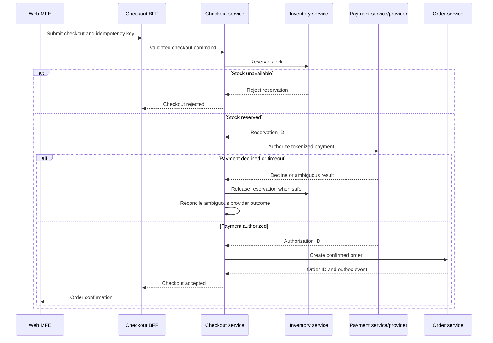

# Checkout Saga

[Diagram index](README.md) · [Application architecture](../architecture/application-platform.md) · [Event platform](../architecture/event-platform.md)

## Saga requirements

- Persist state and every transition.
- Make commands, callbacks and compensations idempotent.
- Use timeouts and explicit ambiguous states.
- Never hold a distributed database transaction.
- Reconcile provider, payment, order and inventory ledgers.
- Emit versioned outcome events after authoritative transitions.

