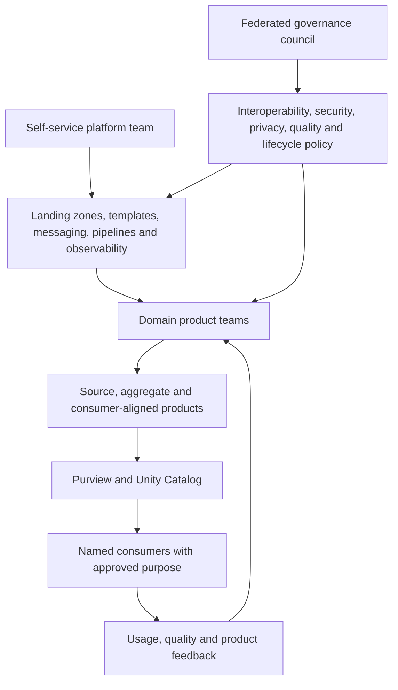

# Data-Mesh Operating Model

[Diagram index](README.md) · [Data-mesh architecture](../architecture/data-mesh.md)

## Responsibility mapping

| Capability | Domain team | Platform team | Federated council | Consumer |
|---|---|---|---|---|
| Business meaning | Accountable | Consulted | Global terminology standards | Validates usefulness |
| Product contract | Owns | Supplies schema/template/registry | Defines minimum fields/policy | Registers dependency |
| Pipeline and quality | Owns product logic/SLO | Supplies runtime and controls | Defines global minimum | Reports observed quality |
| Access and privacy | Classifies/approves | Automates grants/masks/audit | Defines policy | States purpose and constraints |
| Lifecycle | Versions/deprecates/supports | Supplies usage/dependency tooling | Defines notice/retention | Migrates before deadline |
| Cost | Owns product budget | Allocates and optimizes platform | Defines allocation policy | Uses within contracted limits |

