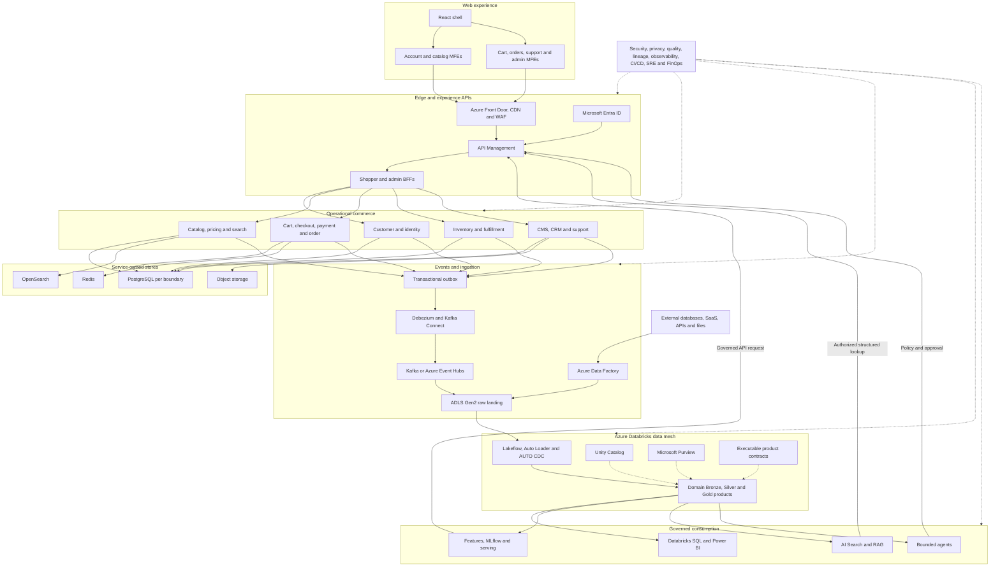

# End-to-End Architecture

[Diagram index](README.md) · [Architecture overview](../architecture/README.md)

The commit-ready vector diagram is [end-to-end-architecture.svg](end-to-end-architecture.svg). The Mermaid source below remains in Markdown for text search, review and maintenance.

## Boundary summary

- MFEs use BFF/domain APIs only.
- Microservices own transactional truth and writable data.
- The outbox/CDC path publishes facts without a database/event dual write.
- ADF lands controlled batch/external inputs.
- Domain teams own Bronze/Silver/Gold products under contracts and federated governance.
- BI/ML/RAG/agents consume governed ports; state changes return through APIs.
