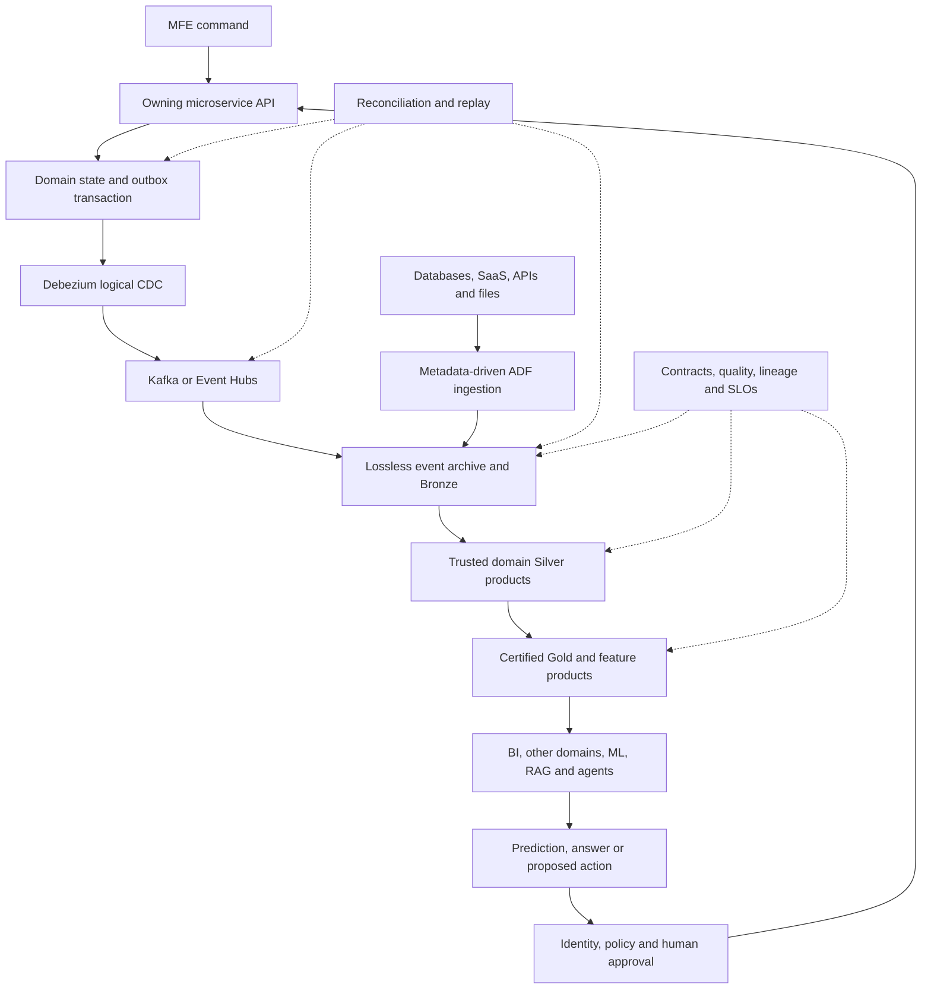

# Event and Data Flow

[Diagram index](README.md) · [Event platform](../architecture/event-platform.md) · [Data mesh](../architecture/data-mesh.md)

## Processing semantics

| Boundary | Required behavior |
|---|---|
| Service transaction | Domain state and outbox commit atomically |
| Event delivery | At least once; stable ID, key, contract and trace metadata |
| Consumer | Deduplicated/idempotent durable effect before checkpoint commit |
| Bronze | Lossless, replayable, source-positioned and quarantines corruption |
| Silver | Deterministic CDC, deletes, SCD, late data and source reconciliation |
| Gold | Declared grain, semantics, owner, SLO and ledger reconciliation |
| Feedback | Policy-approved API request; no direct operational database write |

