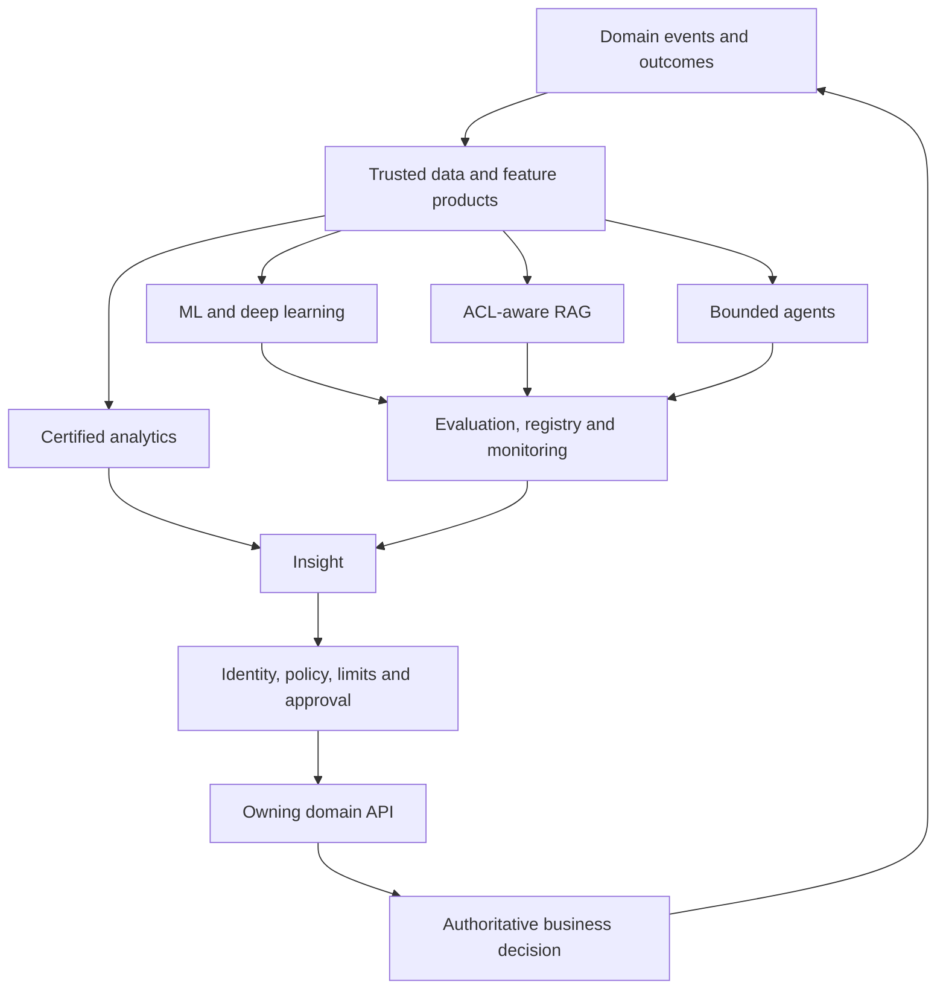

# Intelligence Feedback Loop

[Diagram index](README.md) · [Analytics, ML and AI](../architecture/analytics-ml-ai.md)

## Control rule

Analytics and AI may recommend, explain or propose. The owning service authorizes and executes the state transition. Orders, prices, payment status, inventory, consent and customer records remain operational truth.

